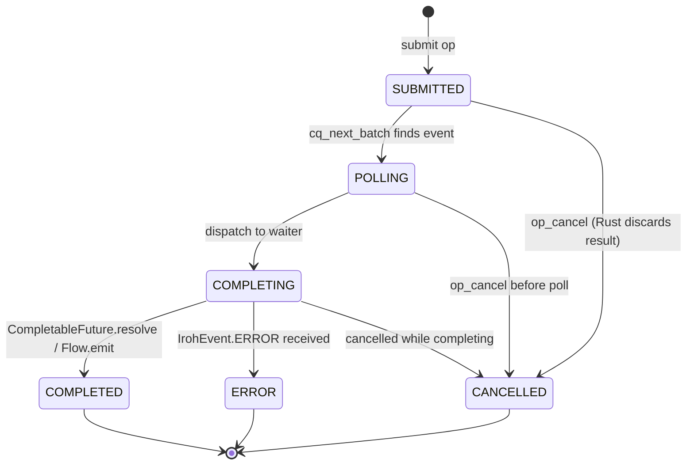

# JVM Binding Progress

**Package:** `com.aster`
**Target:** Java 25 (FFM stable, no preview flag)
**ABI contract:** Actual Rust FFI at `ffi/src/lib.rs`
**Native library:** `libaster_transport_ffi.dylib` from `ffi/` crate
**Build:** Maven with Java 25
**Status:** `mvn verify` passes — 0 SpotBugs bugs

---

## Phase 1 — Foundation (FFM plumbing)

All Phase 1 items implemented. `mvn verify` passes with 0 SpotBugs bugs.

- [x] `IrohLibrary` — singleton, loads native lib via `SymbolLookup.libraryLookup(Path, Arena)`, struct layouts match actual Rust FFI
- [x] Version check — `iroh_abi_version_major/minor/patch` calls
- [x] Struct layouts — `IROH_BYTES`, `IROH_BYTES_LIST`, `IROH_RUNTIME_CONFIG`, `IROH_ENDPOINT_CONFIG`, `IROH_CONNECT_CONFIG`, `IROH_EVENT` (verified against actual Rust `#[repr(C)]` structs)
- [x] `IrohEventKind` — all enum values from Rust `iroh_event_kind_t`
- [x] `IrohStatus`, `IrohException`, `IrohRelayMode`
- [x] `IrohEvent` — record with `fromSegment()`, correct field offsets
- [x] `OperationRegistry` — `ConcurrentHashMap<op_id, CompletableFuture<IrohEvent>>`
- [x] `IrohPollThread` — platform thread, `iroh_poll_events`, `CopyOnWriteArrayList<Consumer<IrohEvent>>`
- [x] `IrohHandle` — abstract base, `Cleaner` backstop, typed free
- [x] `IrohRuntime` — owns runtime handle, starts poller, `buffer_release`, `operation_cancel`, `endpointCreateAsync`
- [x] `IrohEndpoint` — `iroh_endpoint_create` async, `iroh_endpoint_close`, `connectAsync(nodeId, alpn)`, `acceptAsync`
- [x] `IrohConnection` — `iroh_open_bi`, `iroh_accept_bi`, `iroh_connection_close`
- [x] `IrohStream` — `iroh_stream_write`, `iroh_stream_finish`, `iroh_stream_stop` (sync), `iroh_stream_read` (async), `Flow.Publisher<byte[]>` via `SubmissionPublisher`, immediate copy+release for `FRAME_RECEIVED`
- [x] `EndpointConfig` builder for `iroh_endpoint_config_t`
- [x] `LeakTracker` — `ConcurrentHashMap` + `Cleaner`, `assertClean()` for test harness

**Exit criterion:** `mvn verify` passes, static analysis clean.

---

## Phase 2 — Connection and Streams

- [x] `ConnectionConfig` builder for `iroh_connect_config_t` (for `connectAsync`)
- [x] `iroh_node_id` FFI binding + `IrohEndpoint.nodeId()` for node identity exchange
- [x] `IrohRuntime.create()` factory for test convenience
- [x] Integration test: `ConnectionStreamsIntegrationTest` — create runtime → create endpoint → connect two endpoints → open stream → send/receive frame (`@Disabled` until native lib + network available)
- [ ] Verify `iroh_buffer_release` discipline under load
- [ ] Stress test with native memory tracking

**Exit criterion:** Can connect two endpoints and send a framed payload over a bidirectional stream.

---

## Phase 3 — Endpoint identity and relay configuration

- [x] `secret_key_seed` handling — 32-byte seed through `EndpointConfig.secretKey(byte[])`
- [x] Secret key export (`iroh_endpoint_export_secret_key`) — stores seed in `BridgeRuntime.endpoint_secret_keys` at create time; exported via `iroh_endpoint_export_secret_key`
- [x] Relay mode (`DEFAULT`, `CUSTOM`, `DISABLED`) via `EndpointConfig.relayMode()` + typed `relayMode(IrohRelayMode)`
- [x] Custom relay URLs via `EndpointConfig.relayUrls()`
- [x] `data_dir_utf8` — added to `iroh_endpoint_config_t` (144 bytes); wired through `CoreEndpointConfig.data_dir`

---

## Phase 4 — High-level API layer

- [x] `IrohNode` facade — `memory()`, `memoryWithAlpns()`, `persistent()`, `persistentWithAlpns()` factory methods
- [x] `connections` flow — `Flow<AcceptedAster>` for incoming Aster connections via `MutableSharedFlow`
- [x] `nodeId()` — hex string endpoint ID via `iroh_node_id`
- [x] `nodeAddr()` — structured `NodeAddr` via `iroh_node_addr_info`
- [x] `exportSecretKey()` — 32-byte secret key seed via `iroh_node_export_secret_key`
- [x] `close()` — cancels accept loop, frees node handle via `iroh_node_free`
- [x] Pure Java implementation (no Kotlin coroutines) — `CompletableFuture` + custom `Flow`/`MutableSharedFlow`
- [ ] Kotlin coroutine wrappers (`suspend` over CF) — deferred, separate Kotlin wrapper project

---

## Phase 5 — CQ Architecture (Already Implemented)

### What Exists Already

The CQ architecture described in `ffi_spec/FFI_PLAN.md` is **already implemented**:

**Rust (`ffi/src/lib.rs`):**
- `BridgeRuntime` — owns tokio runtime + `mpsc` event channel + all handle registries
- `HandleRegistry<Arc<T>>` — Arc-wrapped handles; safe to clone across async tasks; `get()` returns `Arc<T>`, so handle free while task holds a clone is safe
- `iroh_poll_events` — batch drain of completion queue; `timeout_ms=0` non-blocking, `timeout_ms>0` blocking up to timeout; returns count of events written
- `iroh_operation_cancel` — cancels op, emits `IROH_EVENT_OPERATION_CANCELLED`
- `iroh_buffer_release` — releases buffer lease after Java reads `data_ptr/data_len`
- `iroh_node_accept_aster` — **non-blocking**; spawns tokio task, returns `op_id` immediately; emits `IROH_EVENT_ASTER_ACCEPTED` when connection arrives

**Java (`IrohPollThread`):**
- One platform thread per `IrohRuntime` — NOT per node, NOT per operation
- Calls `iroh_poll_events` in a loop, batch-dispatches events to `OperationRegistry` and inbound handlers
- `OperationRegistry` maps `op_id → CompletableFuture<IrohEvent>`; poller calls `registry.complete(opId, event)` → future resolves
- `iroh_event_kind_t.IROH_EVENT_ASTER_ACCEPTED` dispatched to inbound handlers (not operation futures)

**`IrohEndpoint` is correct:** `acceptAsync()` calls `iroh_accept` (non-blocking submit), registers future, future completed by poller.

### What Is Wrong: `IrohNode`

`IrohNode` builds redundant infrastructure instead of reusing `IrohRuntime`'s poller:
- Creates its own `ExecutorService` (4 daemon threads per node)
- Runs `startAcceptLoop()` as a thread that blocks on `acceptAsterAsync().get()`
- Has its own accept loop when it should use the runtime's existing poller

This is not a CQ correctness problem — the CQ/future/poller chain is correct. It is a **resource waste** problem: 4 threads per node that are mostly idle, when the runtime's poller already handles all completions for all handles on that runtime.

### Phase 5 Real Work

1. **Audit** — Is any Java FFI call still actually blocking (not returning `op_id` immediately)? `iroh_node_memory`, `iroh_node_persistent`, `iroh_endpoint_create`, `iroh_accept`, `iroh_connect`, `iroh_open_bi`, `iroh_stream_read` — verify each one returns `op_id` immediately, not after completion.
2. **Fix `IrohNode`** — Remove `ExecutorService` and `startAcceptLoop()`. Instead, add `IROH_EVENT_ASTER_ACCEPTED` as an inbound event type to `IrohPollThread`'s handler list. When the poller dispatches `CONNECTION_ACCEPTED`, `IrohNode` wraps it in `AcceptedAster` and emits to its `MutableSharedFlow`.
3. **Remove redundant threads** — after fixing `IrohNode`, verify thread count drops when many nodes are alive.
4. **Write tests** against the existing API (see Phase 5b below).

### Design Principles

1. **Rust owns the runtime and all transport waiting.** Tokio is fully inside Rust. Java sees only submit/complete/cancel/close.
2. **One CQ poller thread set per `IrohRuntime`** — not one blocked thread per outstanding operation.
3. **Batch completions.** `cq_next_batch` drains N events per call to amortize the JNI/FFM crossing cost.
4. **Buffer ownership.** Rust owns completion buffers until `event_release`. Java wraps `data_ptr/data_len` in a `MemorySegment` and copies if needed.
5. **Callbacks are an escape hatch only.** Java 25 FFM supports upcall stubs via `Linker.upcallStub`, but the primary path is Java polling the CQ. Avoid native-to-Java callbacks as the main completion mechanism.
6. **Go and Java share the same C ABI.** The submission/completion model is identical for both languages.
7. **Go and Java are both blocked equally by foreign blocking calls.** Virtual threads cannot help during a foreign call — they get pinned. This is not a Java-specific problem.

### Arena Scoping

- `Arena.ofConfined()` — thread-local, short-lived marshalling (path bytes, ALPN bytes, input buffers). Explicit `.close()` after FFI call returns.
- `Arena.ofShared()` — where memory must cross threads (completion event data that outlives a single call).
- **No `Arena.ofAuto()` in hot paths.** GC-managed release timing is unpredictable under load.

### Phase 5 Audit Results

All Java FFI calls audited against `ffi/src/lib.rs`. Result: **zero blocking calls**. Every async operation returns `op_id` immediately and defers work to a tokio task.

#### Synchronous calls (immediate return, no op_id)

| Function | Return | Notes |
|----------|--------|-------|
| `iroh_abi_version_major/minor/patch` | `i32` | Pure version query |
| `iroh_last_error_message` | `size_t` | Copies into caller buffer |
| `iroh_status_name` | `*const c_char` | Pure query |
| `iroh_runtime_close` | `void` | Synchronous shutdown |
| `iroh_poll_events` | `usize` count | Blocking drain of CQ; called only by `IrohPollThread` (correct) |

#### Async calls (non-blocking submit → tokio task → CQ event)

| Function | Op ID | Event Kind | Blocking? |
|----------|-------|-----------|------------|
| `iroh_node_memory` | ✅ | `NODE_CREATED` | **No** — `runtime.spawn` + `.await` inside task |
| `iroh_node_persistent` | ✅ | `NODE_CREATED` | **No** |
| `iroh_node_memory_with_alpns` | ✅ | `NODE_CREATED` | **No** |
| `iroh_node_accept_aster` | ✅ | `ASTER_ACCEPTED` | **No** — each call spawns independent tokio accept task |
| `iroh_endpoint_create` | ✅ | `ENDPOINT_CREATED` | **No** |
| `iroh_endpoint_close` | ✅ | `CLOSED` | **No** |
| `iroh_connect` | ✅ | `CONNECTED` | **No** |
| `iroh_accept` | ✅ | `CONNECTION_ACCEPTED` | **No** |
| `iroh_connection_close` | ✅ | `CLOSED` | **No** |
| `iroh_open_bi` | ✅ | `STREAM_OPENED` | **No** |
| `iroh_accept_bi` | ✅ | `STREAM_ACCEPTED` | **No** |
| `iroh_open_uni` | ✅ | `STREAM_OPENED` | **No** |
| `iroh_accept_uni` | ✅ | `STREAM_ACCEPTED` | **No** |
| `iroh_connection_read_datagram` | ✅ | `BYTES_RESULT` | **No** |
| `iroh_stream_write` | ✅ | `SEND_COMPLETED` | **No** |
| `iroh_stream_finish` | ✅ | `STREAM_FINISHED` | **No** |
| `iroh_stream_stop` | ✅ | `STREAM_RESET` | **No** |
| `iroh_stream_read` | ✅ | `FRAME_RECEIVED` | **No** |
| `iroh_node_id` | ✅ | `STRING_RESULT` | **No** |
| `iroh_node_addr_info` | ✅ | `BYTES_RESULT` | **No** |
| `iroh_node_export_secret_key` | ✅ | `STRING_RESULT` | **No** |
| `iroh_endpoint_node_id` | ✅ | `STRING_RESULT` | **No** |
| `iroh_endpoint_export_secret_key` | ✅ | `STRING_RESULT` | **No** |
| `iroh_add_peer` | ✅ | `UNIT_RESULT` | **No** |
| `iroh_operation_cancel` | — | `OPERATION_CANCELLED` | **No** — synchronous cancel, emits event |

#### Additional findings

**Arena scoping:**
- `IrohLibrary` uses `Arena.ofAuto()` for its singleton arena — used for process-long allocations (symbol lookup, method handles). **KEEP as-is** — these are truly long-lived.
- **Fixed**: All hot-path methods now use `Arena.ofConfined()` per-call for FFI input scratch. When the arena goes out of scope at method return, memory is deterministically released rather than waiting for GC. Fixed methods:
  - `IrohStream.sendAsync()`, `finishAsync()`, `readAsync()`
  - `IrohConnection.openBiAsync()`, `acceptBiAsync()`
  - `IrohEndpoint.nodeId()`, `connectAsync()`, `acceptAsync()`, `closeAsync()`, `exportSecretKey()`
  - `IrohRuntime.endpointCreateAsync()`
  - `IrohNode.nodeId()`, `nodeAddr()`, `exportSecretKey()`, `createNodeViaFfi()`
- `IrohException.lastErrorMessage()` creates a short-lived `Arena.ofAuto()` — immediately discarded after the call. Fine.
- `IrohPollThread` event buffer uses `Arena.ofAuto()` — long-lived, thread-associated, correct.
- `IrohRuntime` constructor config uses `Arena.ofAuto()` — short-lived setup, fine.

**Handle close coverage:**

| Handle | Free function | Java close | Leak risk |
|--------|--------------|------------|-----------|
| `IrohRuntime` | `iroh_runtime_close` | ✅ `IrohRuntime.close()` | None |
| `IrohEndpoint` | `iroh_endpoint_close` | ✅ `IrohEndpoint.close()` | None — but Cleaner comment warns async, explicit close required |
| `IrohConnection` | `iroh_connection_close` | ✅ `IrohConnection.close()` | None — sync, safe from Cleaner |
| `IrohStream` (send) | `iroh_send_stream_free` | ✅ `IrohStream.close()` | None |
| `IrohStream` (recv) | `iroh_recv_stream_free` | ✅ `IrohStream.close()` | None |
| `IrohNode` | `iroh_node_free` | ✅ `IrohNode.close()` | None |

**`IrohStream`** now has three event surfaces:
- `receiveFrames()` — `Publisher<byte[]>` of all frames (existing, via `SubmissionPublisher`)
- `readAsync(maxLen)` — `CompletableFuture<byte[]>` per-frame read (fixed: now correlates by `op_id` so the correct future is completed with frame data; frames also submitted to `receiveFrames()`)
- `closed()` — `Publisher<StreamTerminated>` emitting exactly once on `STREAM_FINISHED` or `STREAM_RESET`
- `close()` now frees both native handles and closes both publishers

#### Verdict

**CQ architecture is correctly implemented at the FFI boundary.** No Java FFI call blocks the calling thread. Tokio is fully inside Rust where it belongs.

Issues found (Priority order):
1. **`IrohStream` handle leak** — `close()` doesn't free native handles. Fix: call `iroh_send_stream_free` / `iroh_recv_stream_free` in `close()`. **FIXED.**
2. **`IrohNode.startAcceptLoop()`** — redundant `ExecutorService` (4 threads) + polling loop; should register with runtime poller instead. **FIXED.**
3. **`Arena.ofAuto()` in hot path** — `IrohLibrary.allocator()` used for all FFI input scratch; should use `Arena.ofConfined()` per-call for hot-path allocations. **FIXED.**

### Phase 5 Tasks

- [x] Audit all FFI calls for blocking behavior — zero blocking calls found
- [x] Fix `IrohStream` handle leak — `close()` now calls `iroh_send_stream_free` + `iroh_recv_stream_free`; both send and recv handles stored and freed
- [x] Simplify `IrohNode` — removed redundant `ExecutorService` (4 threads per node); replaced `startAcceptLoop()` with inbound handler registration on `IrohRuntime`'s existing `IrohPollThread`; `close()` now calls `removeInboundHandler` to clean up
- [x] Arena scoping — use `Arena.ofConfined()` per-call for FFI input scratch in hot paths; keep `IrohLibrary` singleton arena for long-lived allocations only

---

## Phase 5b — CQ Test Suite

See [**PHASE_5B_TESTS.md**](./PHASE_5B_TESTS.md) for the full test design and task list.

<!-- TOC placeholder -->
<!-- ## 5b.1 CQ State Machine -->
<!-- ## 5b.2 Deterministic Concurrency -->
<!-- ## 5b.3 Unsafe Memory Tests -->
<!-- ## 5b.4 Fuzz the ABI -->
<!-- ## 5b.5 ABI Contract Tests -->
<!-- ## 5b.6 Real Integration Tests -->
<!-- ## 5b.7 Cross-Language Conformance -->
<!-- ## 5b.8 Performance Tests -->
<!-- ## 5b.9 Long-Run Soak -->

---

## Phase 5 Evaluation Plan

### CQ State Machine



**States per `op_id`:**
- `SUBMITTED` — op queued in Rust CQ, waiting to be selected
- `POLLING` — `cq_next_batch` has returned the event, dispatch in progress
- `COMPLETING` — waiter has received the event, post-processing active
- `COMPLETED` — terminal, result delivered
- `CANCELLED` — terminal, op cancelled before completion
- `ERROR` — terminal, error event received

### Memory Safety Tests

#### 1. Lifecycle accountability (`LeakTracker` integration)
Each test creates N ops, awaits their completion or cancellation, then asserts `LeakTracker.assertClean()`.
Verifies every `op_id` that entered Rust CQ reaches a terminal state with no orphaned Rust-side state.

#### 2. Buffer ownership — no use-after-free
```java
IrohEvent ev = drainOneEvent(); // data_ptr valid here
byte[] copy = dataSegmentToByteArray(ev); // Java copies
eventRelease(ev); // Rust buffer freed
// copy still valid, ev.data_ptr must not be used after event_release
```
Assert copy contents are correct after `event_release`. Measure with AddressSanitizer / Valgrind.

#### 3. Arena discipline
- Input arenas (`Arena.ofConfined()`) scoped to single FFI call: assert arena is closed within the same thread immediately after the call returns.
- Output/shared arenas: verify `Arena.close()` is called on `IrohRuntime.close()`, not left to GC.
- No `Arena.ofAuto()` in hot paths.

#### 4. Cancellation correctness
```java
opId = accept_submit(node, tag);
op_cancel(opId);          // cancel before Rust selects it
event = cq_next_batch();  // must NOT receive cancelled op's event
// Verify: event is either not-from-cancelled-op, or error
```

#### 5. Close-while-active
```java
node = IrohNode.memory().join();
Future<?> accept = connections.collect(c -> {}); // SUBMITTED
node.close();               // close while accept is pending
// All SUBMITTED ops must be cancelled
// All POLLING/COMPLETING ops must complete or error gracefully
// CQ poller threads must terminate
assert leakTracker.assertClean();
```

#### 6. Re-submit same user_tag
Submit same `user_tag` twice before either completes.
Rust must issue distinct `op_id`s. Java must not conflate completions.

#### 7. Hostile: invalid handle submitted
```java
handle_close(validHandle);
submit_op(invalidHandle); // must return error, not segfault
```

#### 8. Hostile: corrupt event data
Mock `cq_next_batch` returning garbage `op_id` values.
Java must handle gracefully (lookup in registry returns null/unknown op, skipped).

#### 9. Hostile: duplicate data_ptr in batch
Two events with same `data_ptr` in one batch.
Java must copy both independently — verify no aliasing.

#### 10. Hostile: premature event_release
Call `event_release` on buffers Rust is still using (only testable via Rust instrumentation).
Rust should tolerate duplicate release or return an error; must not segfault.

### Performance Tests

#### 1. Thread footprint
**Metric:** Platform thread count vs concurrent nodes × outstanding ops.
**Method:** Create 10 `IrohNode` instances, each with 50 outstanding accept/read ops.
**Pass criteria:** Thread count is bounded (~O(poller_threads), not O(nodes × ops)).
**Baseline:** Current blocking model creates 1 thread per blocking FFI call.

#### 2. Single-op latency histogram
**Metric:** P50/P95/P99/P99.9 for accept, connect, read, write.
**Method:** Single-threaded client, measure `submit` → completion time.
**Pass criteria:** CQ model within 10% of blocking model (submit is near-zero; completion is the wait).

#### 3. CQ batch efficiency
**Metric:** Events per `cq_next_batch` call under load.
**Method:** 100 concurrent connections doing writes; measure batch sizes.
**Pass criteria:** Average batch size > 1 under load (proves batching is working).
**Baseline:** Batch size = 1 always means each call is crossing FFI for a single event.

#### 4. Throughput scaling
**Metric:** Ops/second vs concurrent connections.
**Method:** N connections, each doing continuous read/write loop.
**Pass criteria:** Throughput scales linearly with connections up to CQ drain capacity.
**Baseline:** Blocking model plateaus or degrades when threads become the bottleneck.

#### 5. Memory per op
**Metric:** `MemorySegment` allocation count and total arena memory per outstanding op.
**Method:** Profile with async-profiler, count allocations under 1000 concurrent ops.
**Pass criteria:** CQ model has lower per-op memory overhead than blocking model (no per-op thread stack).

#### 6. Virtual thread efficiency
**Metric:** Do virtual threads waiting on `CompletableFuture` actually yield during the wait between submit and completion?
**Method:** 1000 virtual threads each doing submit → `cf.get()`. Observe carrier thread count.
**Pass criteria:** Carrier threads << 1000 (virtual threads yield efficiently between future completion and next FFI call).
**Baseline:** Current model — virtual threads still pin during FFI block.

### Test Naming Convention

```
MemorySafety:
  Lifecycle_accountability
  BufferOwnership_noUseAfterFree
  ArenaDiscipline_confinedNotAuto
  Cancellation_correctness
  CloseWhileActive_noLeak
  Resubmit_sameTagDistinctOpIds
  Hostile_invalidHandle
  Hostile_corruptEventData
  Hostile_duplicateDataPtr
  Hostile_prematureRelease

Performance:
  ThreadFootprint_boundedVsLinear
  LatencyHistogram_acceptP99
  LatencyHistogram_connectP99
  CQBatchEfficiency_avgBatchSizeGt1
  ThroughputScales_linearly
  MemoryPerOp_lowerThanBlocking
  VirtualThreadYield_efficient
```

---

## Phase 6 — Error handling and diagnostics

- [x] `iroh_last_error_message` wrapping — `IrohLibrary.lastErrorMessage()` + `IrohException.getMessageWithNativeDetail()`
- [x] Typed exception hierarchy from `iroh_status_t` + `iroh_event_kind_t.ERROR` — 8 typed subclasses in `com.aster.exception`, `IrohException.forStatus()` factory, `IrohPollThread` dispatches typed exceptions for ERROR events, `IrohStatus` extended with TIMEOUT/CANCELLED/CONNECTION_REFUSED/STREAM_RESET
- [x] Operation cancellation (`iroh_operation_cancel`) — `IrohRuntime.cancelOperation(long)` already present

---

## Phase 7 — Build and distribution

- [ ] `build.gradle.kts` alternative (optional, Maven is primary)
- [ ] Native lib loading (`System.loadLibrary` or `IROH_LIB_PATH`)
- [ ] Publish to Maven local
- [ ] Cross-platform detection (dylib/mach-o/so/dll)

---

## Phase 8 — Full API Surface Completion

See [PHASE8.md](PHASE8.md) for the detailed checklist.

### Summary of groups:
1. **Connection extras** — datagrams, remote ID, onClosed (smallest surface)
2. **Blobs** — file transfer (highest value)
3. **Tags** — key→blob mapping
4. **Docs** — content-addressed store with sync (most complex)
5. **Gossip** — pub/sub (independent, well-scoped)
6. **Endpoint extras** — metrics, hooks
7. **Signing/tickets** — utility layer

### Implementation status
- [x] 8.1 — Connection extras (remoteId, datagrams, onClosed)
- [x] 8.2 — Blobs
- [ ] 8.3 — Tags
- [ ] 8.4 — Docs
- [ ] 8.5 — Gossip
- [ ] 8.6 — Endpoint extras
- [ ] 8.7 — Signing and tickets

---

## Key Design Decisions

| Decision | Rationale |
|----------|-----------|
| `com.aster` package | Simple, no hyphen |
| Java 25 | FFM is stable (no `--enable-preview`), best current FFI support |
| Platform thread for poller | Virtual threads must not block on `iroh_poll_events` |
| Platform thread for accept loop | FFI blocking pins virtual threads; correct choice for native waits |
| `CopyOnWriteArrayList` for handlers | Thread-safe, supports add/remove at runtime |
| Immediate copy+release for `FRAME_RECEIVED` | Native buffer released immediately after copy; avoids double-free |
| `Arena.ofConfined()` for marshalling | Thread-local, short-lived; explicit `.close()` after FFI call |
| `Arena.ofShared()` for cross-thread memory | Completion event data that outlives a single call |
| No `Arena.ofAuto()` in hot paths | GC-managed release timing is unpredictable under load |
| `ConcurrentHashMap` for operation registry | `op_id → CompletableFuture` under concurrent load |
| `StructLayout` + `VarHandle` for struct encoding | Single layout definition is self-documenting; named fields eliminate manual offset arithmetic and prevent off-by-one errors |
| `SymbolLookup.libraryLookup(String, Arena)` | String soname overload avoids `Path.of()` wrapper; direct and simpler |
| Pure Java for core binding | Kotlin/Java 25 FFM incompatibility; Kotlin wrapper as separate project |
| CQ model for all transport waits | Fixed poller threads (not per-operation); Rust owns Tokio; shared C ABI with Go |
| Callbacks are escape hatch only | Upcall stubs are restricted and unsafe for the primary completion path |

## Out of Scope

- Service stub generation (codegen)
- Fory serialization
- Interceptor chain
- Registry/gossip/blob APIs
- .NET binding

---

## Java 25 FFM API Reference

Native library loading:
```java
// String form — simplest, soname or absolute path
SymbolLookup lib = SymbolLookup.libraryLookup("/path/lib.dylib", Arena.ofAuto());
// Path form also works:
SymbolLookup lib = SymbolLookup.libraryLookup(Path.of("/path/lib.dylib"), Arena.ofAuto());
MemorySegment sym = lib.findOrThrow("function_name");
MethodHandle mh = Linker.nativeLinker().downcallHandle(sym, functionDescriptor);
```

Struct layout with `VarHandle` for type-safe field access (preferred over manual offsets):
```java
// Define once; field names are self-documenting
static final MemoryLayout CONFIG = MemoryLayout.structLayout(
    ValueLayout.JAVA_INT.withName("struct_size"),
    ValueLayout.JAVA_INT.withName("relay_mode"),
    IROH_BYTES.withName("secret_key"),   // nested group layout
    ValueLayout.JAVA_INT.withName("enable_discovery")
    // ...
);

static final VarHandle VH_RELAY_MODE =
    CONFIG.varHandle(MemoryLayout.PathElement.groupElement("relay_mode"));
static final VarHandle VH_SECRET_KEY_PTR =
    CONFIG.varHandle(MemoryLayout.PathElement.groupElement("secret_key"));

// At encode time — no offset arithmetic needed:
MemorySegment seg = allocator.allocate(CONFIG);
VH_RELAY_MODE.set(seg, 1L);                    // boolean-as-int
VH_SECRET_KEY_PTR.set(seg, dataSeg);           // MemorySegment for ptr field
```

Memory allocation:
```java
Arena arena = Arena.ofAuto();
SegmentAllocator alloc = arena; // Arena implements SegmentAllocator
MemorySegment seg = alloc.allocate(ValueLayout.JAVA_INT);           // 4 bytes
MemorySegment seg2 = alloc.allocate(ValueLayout.JAVA_INT, 10);     // 10 ints
```

Creating bounded segments from native pointers:
```java
MemorySegment unbounded = MemorySegment.ofAddress(nativePtr);
MemorySegment bounded = unbounded.reinterpret(byteLength, arena, null);
```
