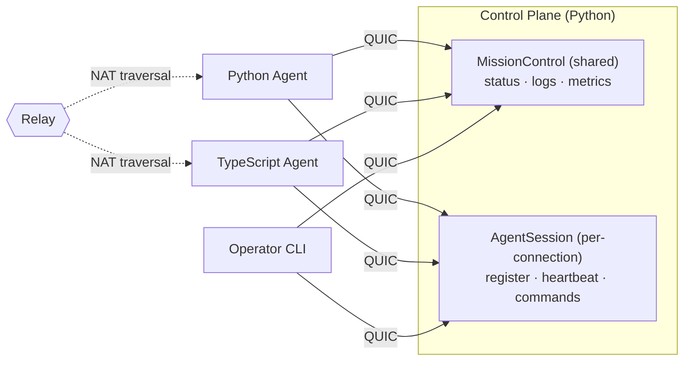

# Mission Control

> You need two services to talk. So you set up a load balancer, provision
> TLS certs, write protobuf schemas, compile them, configure a service mesh,
> deploy to Kubernetes, and pray the health checks converge before the
> demo tomorrow.
>
> Or: you write one Python file and run it.

```python
@service(name="MissionControl", version=1)
class MissionControl:
    @rpc()
    async def getStatus(self, req: StatusRequest) -> StatusResponse:
        return StatusResponse(agent_id=req.agent_id, status="running")
```

```bash
python control.py          # that's the server
aster shell aster1Qm...   # that's the client — tab completion, typed responses
```

No YAML. No protobuf compilation. No port numbers. No cloud account.
Encrypted, authenticated, works across NATs, and your TypeScript
colleague can call it too.

**What you're replacing:** Traditional RPC means writing `.proto` files,
compiling them, setting up TLS certificates, configuring a reverse proxy
or service mesh so clients can find your service, managing certificate
rotation, and repeating all of that for every new service. With Aster you
get mTLS-grade mutual authentication (no CA infrastructure), gRPC-style
streaming RPCs (no `.proto` compilation), and peer-to-peer connectivity
(no port forwarding or load balancers). Your TypeScript teammate calls
your Python service without installing anything from your repo.

This guide builds **Mission Control** — a control plane for managing
remote agents. An agent could be a CI runner, an IoT sensor, an AI
worker, or a service on your colleague's laptop across the world.

In under an hour you'll have:
- Agents that check in, push metrics, and stream logs
- Operators that watch, issue commands, and control access
- A TypeScript agent talking to the Python control plane

Everything runs peer-to-peer. No infrastructure beyond a relay for
NAT traversal (self-hostable). Once peers find each other, traffic
flows direct.



> Aster uses [Iroh's public relays](https://iroh.computer) for discovery
> and NAT traversal by default. Point to your own with a single
> environment variable: `IROH_RELAY_URL=https://relay.yourcompany.com`.

---

## Install

Two packages -- the framework and the CLI:

```bash
uv pip install aster-rpc aster-cli
# or:
pip install aster-rpc aster-cli
```

The framework gives you `from aster import ...` for your service code.
The CLI gives you `aster shell`, `aster trust keygen`, `aster enroll node`,
and `aster contract gen-client` -- the operator tools you'll use throughout
this guide.

Verify:

```bash
aster --version
```

**Requirements:** Python 3.9 -- 3.13, macOS / Linux / Windows. The framework
ships as pre-built wheels for the common platforms.

---

## Chapter 1: Your First Agent Check-In (5 min)

**Goal:** The full working version of what you just saw — define a service,
start it, call it.

```python
# control.py
from dataclasses import dataclass
from aster import AsterServer, service, rpc, wire_type

@wire_type("mission/StatusRequest")
@dataclass
class StatusRequest:
    agent_id: str = ""

@wire_type("mission/StatusResponse")
@dataclass
class StatusResponse:
    agent_id: str = ""
    status: str = "idle"
    uptime_secs: int = 0

@service(name="MissionControl", version=1)
class MissionControl:
    @rpc()
    async def getStatus(self, req: StatusRequest) -> StatusResponse:
        return StatusResponse(
            agent_id=req.agent_id,
            status="running",
            uptime_secs=3600,
        )

async def main():
    async with AsterServer(services=[MissionControl()]) as srv:
        print(srv.address)       # compact aster1... address
        await srv.serve()

if __name__ == "__main__":
    import asyncio
    asyncio.run(main())
```

```bash
# Terminal 1: start the control plane
python control.py
# → aster1Qm...

# Terminal 2: connect and inspect
aster shell aster1Qm...
> cd services/MissionControl
> ./getStatus agent_id="edge-node-7"
```

Or skip the shell entirely -- call it straight from the command line:

```bash
aster call aster1Qm... MissionControl.getStatus '{"agent_id": "edge-node-7"}'
```

> **`aster shell` vs `aster call`:** Use `aster shell` for interactive
> exploration -- browsing services, tab-completing methods, streaming.
> Use `aster call` for scripting and one-shot invocations. Both use
> JSON serialization under the hood. For production code, use generated
> typed clients (Chapter 6).

**What just happened:**
- `@service` + `@rpc` defined a typed RPC contract
- `@wire_type` made the types serializable across languages — no `.proto`
  files, no separate schema to maintain
- `AsterServer` created an encrypted QUIC endpoint and started listening —
  clients discover the service contract on connect
- `aster shell` connected, discovered the service, and invoked it — with
  tab completion and typed responses
- `aster call` invoked it non-interactively — Aster isn't just a library,
  it's a platform with a first-class CLI

---

## Chapter 2: Live Log Streaming (5 min)

**Goal:** Agents push logs into the control plane. Operators tail them
in real time using server streaming.

```python
from collections.abc import AsyncIterator
from aster import server_stream

# Ordered severity used by the level filter below.
_LEVEL_ORDER = {"debug": 0, "info": 1, "warn": 2, "error": 3, "fatal": 4}

def _level_rank(level: str) -> int:
    return _LEVEL_ORDER.get(level.lower(), 0)

@wire_type("mission/LogEntry")
@dataclass
class LogEntry:
    timestamp: float = 0.0
    level: str = "info"
    message: str = ""
    agent_id: str = ""

@wire_type("mission/SubmitLogResult")
@dataclass
class SubmitLogResult:
    accepted: bool = True

@wire_type("mission/TailRequest")
@dataclass
class TailRequest:
    agent_id: str = ""
    level: str = "info"    # minimum level filter

@service(name="MissionControl", version=1)
class MissionControl:
    def __init__(self):
        self._log_queue = asyncio.Queue()   # just a regular Python queue

    # ... getStatus from Chapter 1 ...

    @rpc()
    async def submitLog(self, entry: LogEntry) -> SubmitLogResult:
        """Agents call this to push log entries."""
        await self._log_queue.put(entry)

    @server_stream()
    async def tailLogs(self, req: TailRequest) -> AsyncIterator[LogEntry]:
        """Stream log entries as they arrive."""
        while True:
            entry = await self._log_queue.get()
            if req.agent_id and entry.agent_id != req.agent_id:
                continue
            if _level_rank(entry.level) < _level_rank(req.level):
                continue
            yield entry
```

```bash
# In the shell:
> ./tailLogs agent_id="edge-node-7" level="warn"
#0 {"timestamp": 1712567890.1, "level": "warn", "message": "disk 92% full", ...}
#1 {"timestamp": 1712567891.3, "level": "error", "message": "health check failed", ...}
# Ctrl+C to stop
```

Or from your own Python code using the proxy client:

```python
# tail_logs.py — consume a server stream programmatically
import asyncio
from aster import AsterClient

async def main():
    client = AsterClient(address="aster1Qm...")
    await client.connect()
    mc = client.proxy("MissionControl")

    # Server-streaming methods are called via `.stream(...)` and iterated
    # with `async for`. The plain `await mc.tailLogs({...})` form is for
    # unary methods only — it will raise on a streaming RPC.
    async for entry in mc.tailLogs.stream({"level": "warn"}):
        print(entry)

    await client.close()

asyncio.run(main())
```

> **Tip:** `tailLogs` blocks until a log entry arrives. If the queue is
> empty, the client waits. Submit a log entry from another terminal
> (or via `aster call ... MissionControl.submitLog '{"message":"test"}'`)
> to see it appear in the stream. Press Ctrl+C to stop.

> **Proxy method shapes** — the proxy uses a different call form per RPC
> pattern, mirroring what each one actually does:
>
> | Pattern | How to call it |
> |---|---|
> | Unary | `await mc.getStatus({...})` |
> | Server stream | `async for x in mc.tailLogs.stream({...}):` |
> | Client stream | `await mc.ingestMetrics(async_iter)` |
> | Bidi stream | `ch = mc.runCommand.bidi(); await ch.open(); ...` |

**What just happened:**
- `@server_stream` turns an async generator into a streaming RPC
- The client receives items as they're yielded -- no polling, no websockets
- Under the hood: a single QUIC stream, with Aster framing, flowing until
  either side closes it
- Agents push entries via `submitLog` -- it's just a regular `asyncio.Queue`
  under the hood. Aster services are plain Python classes with plain state

---

## Chapter 3: Metric Ingestion (5 min)

**Goal:** Agents push thousands of metric datapoints per second using
client streaming.

```python
@wire_type("mission/MetricPoint")
@dataclass
class MetricPoint:
    name: str = ""
    value: float = 0.0
    timestamp: float = 0.0
    tags: dict = field(default_factory=dict)

@wire_type("mission/IngestResult")
@dataclass
class IngestResult:
    accepted: int = 0
    dropped: int = 0

@service(name="MissionControl", version=1)
class MissionControl:
    # ... previous methods ...

    @client_stream()
    async def ingestMetrics(self, stream: AsyncIterator[MetricPoint]) -> IngestResult:
        """Receive a stream of metric points from an agent."""
        accepted = 0
        async for point in stream:
            self._store_metric(point)
            accepted += 1
        return IngestResult(accepted=accepted)
```

On the agent side, we'll start with a **proxy client** — quick to set up,
no types needed on the consumer side:

```python
# agent.py — proxy client (good for prototyping)
import asyncio
from aster import AsterClient

async def main():
    client = AsterClient(address="aster1Qm...")
    await client.connect()
    mc = client.proxy("MissionControl")

    # Stream 10,000 metrics — the proxy accepts dicts
    async def metrics():
        for i in range(10_000):
            from random import random
            from time import time
            yield {"name": "cpu.usage", "value": random(), "timestamp": time()}

    result = await mc.ingestMetrics(metrics())
    print(f"Accepted: {result['accepted']}")

    await client.close()

asyncio.run(main())
```

The proxy client discovers methods from the contract and sends dicts over
the wire. Great for scripting, prototyping, and generic gateways — if
you're building a dashboard that talks to any Aster service without
knowing its types at compile time, the proxy is your best friend.

> **Proxy vs Typed client** — For production, generate a typed client
> with `aster contract gen-client` and use `from_connection()`:
>
> ```python
> from mission_control.services.mission_control_v1 import MissionControlClient
> mc = await MissionControlClient.from_connection(client)
> result = await mc.ingestMetrics(metric_stream())   # IDE autocomplete, type checking
> print(result.accepted)                              # not result['accepted']
> ```
>
> Same wire protocol, same contract — just with type safety. Use the proxy
> for scripts and exploration, the generated client for production services.

**What just happened:**
- Client streaming sends many messages, gets one response at the end
- The producer processes items as they arrive — no buffering the entire batch
- The proxy client requires no type imports — it reads the contract from
  the producer and builds method stubs dynamically
- This is how you'd build telemetry ingestion, log shipping, or bulk data upload

---

## Chapter 4: Agent Sessions & Remote Commands (5 min)

**Goal:** Each agent gets its own session — register, heartbeat, and
execute commands. This is where per-agent state and bidi streaming meet.

`MissionControl` is a shared service — one instance, all clients see the
same state. But each agent needs its own identity, capabilities, and
command channel. That's a session-scoped service:

```python
@wire_type("mission/Heartbeat")
@dataclass
class Heartbeat:
    agent_id: str = ""
    capabilities: list = field(default_factory=list)   # ["gpu", "arm64", ...]
    load_avg: float = 0.0

@wire_type("mission/Assignment")
@dataclass
class Assignment:
    task_id: str = ""
    command: str = ""

@wire_type("mission/Command")
@dataclass
class Command:
    command: str = ""

@wire_type("mission/CommandResult")
@dataclass
class CommandResult:
    stdout: str = ""
    stderr: str = ""
    exit_code: int = -1    # -1 means still running

@service(name="AgentSession", version=1, scoped="session")
class AgentSession:
    """Session-scoped: one instance per connected agent."""

    def __init__(self, peer: str | None = None):
        self._peer = peer
        self._agent_id = ""
        self._capabilities = []

    @rpc()
    async def register(self, hb: Heartbeat) -> Assignment:
        """Agent announces itself and gets an assignment."""
        self._agent_id = hb.agent_id
        self._capabilities = hb.capabilities
        if "gpu" in hb.capabilities:
            return Assignment(task_id="train-42", command="python train.py")
        return Assignment(task_id="idle", command="sleep 60")

    @rpc()
    async def heartbeat(self, hb: Heartbeat) -> Assignment:
        """Periodic check-in — update load, maybe get new work."""
        self._capabilities = hb.capabilities
        return Assignment(task_id="continue", command="")

    @bidi_stream()
    async def runCommand(self, commands: AsyncIterator[Command]) -> AsyncIterator[CommandResult]:
        """Execute commands on this agent — stream in, results stream back."""
        async for cmd in commands:
            proc = await asyncio.create_subprocess_shell(
                cmd.command,
                stdout=asyncio.subprocess.PIPE,
                stderr=asyncio.subprocess.PIPE,
            )
            stdout, stderr = await proc.communicate()
            yield CommandResult(
                stdout=stdout.decode(),
                stderr=stderr.decode(),
                exit_code=proc.returncode,
            )
```

```bash
# Operator connects and opens a session subshell:
aster shell aster1Qm...
> cd services
> session AgentSession
# prompt becomes "AgentSession~" — you're now in a dedicated session.
# State persists across calls; the same instance handles every method.
AgentSession~ register agent_id="edge-7" capabilities='["gpu"]'
← {"agent_id": "edge-7", "task": "train-42"}
AgentSession~ runCommand command="df -h"
← {"stdout": "Filesystem  Size  Used ...", "exit_code": 0}
AgentSession~ runCommand command="uptime"
← {"stdout": " 14:32  up 3 days ...", "exit_code": 0}
AgentSession~ end
```

> **Why a session subshell?** Session-scoped services hold per-connection
> state. If you tried `./runCommand` directly from `/services/AgentSession`,
> the shell would open a new stream per call and tear down the state
> between them. The `session` command opens one persistent session and
> routes every method through it. The `AgentSession~` prompt makes it
> obvious you're inside a stateful session. Type `end` to close it.

**What just happened:**
- `scoped="session"` creates a fresh `AgentSession` per connection — each
  agent gets its own identity, capabilities, and command channel
- `runCommand` uses bidi streaming: commands flow in, results flow back,
  all on a single multiplexed QUIC stream
- State like `self._agent_id` is private to that agent's session — no
  hand-rolled connection maps
- When the agent disconnects, the session is cleaned up automatically

Two service types, two different lifetimes:
- **`MissionControl`** (shared) — fleet-wide: status, logs, metrics
- **`AgentSession`** (session) — per-agent: register, heartbeat, commands

---

## Chapter 5: Auth & Capabilities (5 min)

**Goal:** Not every caller should be able to deploy or run commands on agents.
Define roles, compose requirements, and issue scoped credentials.

Up until now the system has run in `open-gate` mode. That's fine sometimes, but other times you need to put controls on who can access your service. In this step, we will enable authentication so our service will no longer be open to anyone who contacts our node — callers will have to prove they're _authorized_.

The auth flow has three steps:
1. **Define** -- declare which capabilities each method requires (in code)
2. **Issue** -- create credentials with specific capabilities (CLI)
3. **Connect** -- present the credential on connect; the framework enforces access

The credential carries an `aster.role` attribute with a comma-separated
list of capabilities. The server's `CapabilityInterceptor` checks this
list against each method's `requires` declaration. No middleware to
write, no token parsing -- it's declarative.

### Step 1: Generate a root key

The root key is the trust anchor for your entire deployment. **It identifies you personally as the owner of your deployment**. Keep it
offline — you'll use it to sign credentials, not to run services.

```bash
# One-time setup — generates an Ed25519 keypair
aster trust keygen --out-key ~/.aster/root.key

# Output:
# Root private key written to: ~/.aster/root.key
# Root public key written to:  ~/.aster/root.pub
# Public key: b3a4f1...
# Keep root.key secret. Share root.pub with nodes that need to verify credentials.
```

### Step 2: Define roles in code

```python
from enum import Enum
from aster import any_of
# Also available: `all_of(A, B)` -- caller must have BOTH roles.

class Role(str, Enum):
    """Capabilities that can be granted to consumers."""
    STATUS  = "ops.status"      # read service status
    LOGS    = "ops.logs"        # tail live logs
    ADMIN   = "ops.admin"       # run commands on agents
    INGEST  = "ops.ingest"      # push metrics (agents)
```

Apply requirements to methods. Simple cases take a single role;
complex cases compose with `any_of` / `all_of`:

```python
@service(name="MissionControl", version=1)
class MissionControl:

    @rpc(requires=Role.STATUS)
    async def getStatus(self, req: StatusRequest) -> StatusResponse: ...

    @server_stream(requires=any_of(Role.LOGS, Role.ADMIN))
    async def tailLogs(self, req: TailRequest) -> AsyncIterator[LogEntry]:
        """Log access for log viewers OR admins — either role works."""
        ...

    @client_stream(requires=Role.INGEST)
    async def ingestMetrics(self, stream: AsyncIterator[MetricPoint]) -> IngestResult:
        """Agents push metrics — scoped to the ingest role."""
        ...

@service(name="AgentSession", version=1, scoped="session")
class AgentSession:

    @rpc(requires=Role.INGEST)
    async def register(self, hb: Heartbeat) -> Assignment: ...

    @bidi_stream(requires=Role.ADMIN)
    async def runCommand(self, commands: AsyncIterator[Command]) -> AsyncIterator[CommandResult]:
        """Command execution is admin-only."""
        ...
```

### Step 3: Start the control plane with auth

```python
config = AsterConfig(
    root_pubkey_file="~/.aster/root.pub", # <- this is the owner's public key (i.e. yours)
    allow_all_consumers=False,   # require credentials
)
async with AsterServer(
    services=[MissionControl(), AgentSession()],
    identity=".aster-identity", # <- this is the identity of the endpoint
    peer="mission-control",
    config=config,
) as srv:
    print(srv.address)
    await srv.serve()
```

Each Aster endpoint will have its own identity (secret key pair) and it will have the public key of its owner (you) so it knows who administers it.

> **No `.aster-identity` file?** Aster generates a fresh ephemeral keypair on startup. That's fine for experiments, but every restart gives you a new endpoint id — and any credentials you issued to the old one will stop working. Once you start enrolling peers, commit to a persistent identity file.

### Step 4: Enroll agents

When you want to allow another endpoint connect to yours, you must give it permission. You do that by generating a _credential_ for it and putting in it the roles that endpoint should have.

```bash
# Issue a credential for an edge agent -- status and ingest only
aster enroll node --role consumer --name "edge-node-7" \
    --capabilities ops.status,ops.ingest \
    --root-key ~/.aster/root.key \
    --out edge-node-7.cred
```

`aster enroll node` will print a summary like this:

```
✓ Enrollment credential created

  File:         /home/you/work/edge-node-7.cred
  Format:       TOML (.aster-identity) with [node] + [[peers]] sections

  Peer:         edge-node-7
  Role:         consumer (policy)
  Capabilities: ops.status,ops.ingest
  Endpoint ID:  142179f10b7bc606...
  Trust root:   cd948e4c1456cdbe...
  Expires:      2026-05-10T20:20:12+00:00

  This file lets a consumer connect to your trusted-mode servers.
  It contains a node identity (secret key) AND a signed enrollment
  credential. The server validates the credential and grants the
  capabilities listed below.

  Use it:
  aster shell <peer-addr> --rcan edge-node-7.cred
  aster call <peer-addr> Service.method '<json>' --rcan edge-node-7.cred

  ⚠  Keep this file secret -- it is both an identity AND a credential.
```

> **What's in the file?** Despite the `.cred` extension, it's a regular
> `.aster-identity` TOML file with two sections:
>
> - `[node]` — the consumer's secret key + endpoint ID. Used by the
>   QUIC layer to prove the consumer's identity.
> - `[[peers]]` — the signed enrollment credential. Presented to
>   servers to claim capabilities.
>
> Both sections live in the same file because they're paired: the
> server checks that the QUIC peer ID matches the credential's
> `endpoint_id`. If they don't match, admission fails.

```bash
# Issue a credential for the ops team -- full access including admin
aster enroll node --role consumer --name "ops-team" \
    --capabilities ops.status,ops.logs,ops.admin,ops.ingest \
    --root-key ~/.aster/root.key \
    --out ops-team.cred
```

> **Need quiet output for scripts?** Use `--quiet` (or `-q`). The
> command prints exactly one line: `<path> <endpoint_id> <expires_iso>`
> on success and exits non-zero on failure. Easy to parse from CI.

### Step 5: Connect with credentials

```python
# agent.py — connecting with a scoped credential
import asyncio
from aster import AsterClient

async def main():
    client = AsterClient(
        address="aster1Qm...",
        enrollment_credential_file="edge-node-7.cred",
    )
    await client.connect()
    mc = client.proxy("MissionControl")
    agent = client.proxy("AgentSession")

    await mc.getStatus({"agent_id": "test"})     # ✓ has ops.status
    await mc.ingestMetrics(...)                   # ✓ has ops.ingest
    # await agent.runCommand(...)                 # ✗ AccessDenied — missing ops.admin

    await client.close()

asyncio.run(main())
```

```bash
# Or from the CLI — the shell respects credentials too
aster shell aster1Qm... --rcan ops-team.cred
> cd services
> session AgentSession                 # opens session subshell
AgentSession~ runCommand command="df"  # ✓ ops-team has ops.admin
```

**What just happened:**
- `aster trust keygen` created the root of trust — one command
- `aster enroll node --role consumer` issued scoped credentials — no CA infrastructure
- `requires=Role.ADMIN` — Aster checks at the method level, no auth middleware to write
- `any_of(A, B)` — caller must have at LEAST ONE (log viewers OR admins can tail)
- The edge agent can push metrics but can't run commands. The ops team can do both.
  That's the entire access control model — defined in code, enforced at the wire level

---

## Chapter 6: Generating Typed Clients (5 min)

**Goal:** Your teammate wants to write a Python script that calls Mission
Control — without importing your source code. Generate a typed client
directly from the running service.

So far you've been using the shell to explore. But for production code,
you want typed clients with IDE autocomplete and compile-time checking.

> **Following on from Chapter 5?** `gen-client` against a live node opens a
> regular consumer connection, so if your server is running in trusted mode
> (`allow_all_consumers=False`) the same credential rules apply: append
> `--rcan ops-team.cred` (or any credential with read access) to the
> commands below. If your server is still in open-gate mode, no credential
> is needed.

### Option A: Generate from a running service

```bash
# Generate a Python client from the live control plane.
# --lang is required (python | typescript) -- there's no default,
# so the same command is the right starting point regardless of
# which language you're targeting.
# Add `--rcan ops-team.cred` if the server is in trusted mode (Chapter 5).
aster contract gen-client aster1Qm... --out ./clients --package mission_control --lang python

# Output:
# Generated 5 files
#   ./clients/mission_control/types/mission_control_v1.py
#   ./clients/mission_control/types/agent_session_v1.py
#   ./clients/mission_control/services/mission_control_v1.py
#   ./clients/mission_control/services/agent_session_v1.py
#   ...
```

### Option B: Generate from an exported manifest

If the producer shared a `.aster.json` file (from `aster contract export`):

```bash
aster contract gen-client ./MissionControl.aster.json --out ./clients --package mission_control --lang python
```

Either way, you get a typed client:

```python
# consumer.py — typed client, no producer source code needed
from aster import AsterClient
from mission_control.services.mission_control_v1 import MissionControlClient
from mission_control.types.mission_control_v1 import StatusRequest

async def main():
    client = AsterClient(address="aster1Qm...")
    await client.connect()

    mc = await MissionControlClient.from_connection(client)
    resp = await mc.getStatus(StatusRequest(agent_id="edge-node-7"))
    print(f"Status: {resp.status}, uptime: {resp.uptime_secs}s")
```

Or explore interactively first, then generate when you're ready:

```bash
# Explore in the shell — no codegen needed
aster shell aster1Qm...
> cd services/MissionControl
> ./getStatus agent_id="edge-node-7"
{"agent_id": "edge-node-7", "status": "running", "uptime_secs": 3600}

# Happy with the API? Generate a client:
> generate-client --out ./clients --package mission_control
Generated 5 files
```

**What just happened:**
- `aster contract gen-client` pulled the contract from the running service
  and generated typed Python clients — no `.proto` files, no shared repo
- The generated client has `from_connection()` which wires up the
  transport, codec, and type registration automatically
- Every generated class carries a `_contract_id` so the consumer can
  detect when the producer has been updated
- The same command works from a `.aster.json` export file — the producer
  doesn't even need to be running

---

## Chapter 7: Cross-Language — TypeScript Agent (5 min)

**Goal:** Your teammate wants to send metrics from their TypeScript
application. They don't have your Python source — just the ticket.

> **Who owns the contract?** The producer — in this case, your Python
> service. Field names on the wire are whatever the **producer**
> defines them as. This Mission Control was written in Python with
> snake_case fields, so the wire is `agent_id`, `uptime_secs`,
> `task_id` regardless of what language the consumer is written in.
>
> Aster's contract validation is **strict**: extra or misspelled
> JSON fields are rejected at decode time with a `CONTRACT_VIOLATION`
> status code, naming the offending field. There's no auto-rename or
> camel/snake normalization to hide bugs. If you typo `agentid` the
> server tells you so, on the same call.
>
> If you generate a typed client (`aster contract gen-client …
> --lang typescript`), the codegen reads the producer's manifest and
> emits TypeScript classes with the producer's field names. You just
> use them like any other TS class — no thinking about wire format.
> If you hand-roll JSON keys via the proxy client below, you have to
> use the producer's field names directly.

Generate a TypeScript client the same way you generated the Python one:

```bash
# Generate TypeScript types + client from the running service
aster contract gen-client aster1Qm... --out ./generated --package mission_control --lang typescript
```

You can `import { MissionControlClient } from
'./generated/mission_control/services/mission-control-v1.js'` and use
the typed TS client just like the Python one. If you'd rather skip
codegen, the proxy client works too — but you'll need to use the
Python server's snake_case field names directly:

```typescript
import { AsterClient } from '@aster-rpc/aster';

const client = new AsterClient({ address: "aster1Qm..." });
await client.connect();

// Proxy client — discovers methods from the contract.
// NOTE: snake_case field names because the PRODUCER (this Python
// MissionControl) defines them that way. The wire format is the
// producer's contract; consumers use it as-is.
const mc = client.proxy("MissionControl");
const status = await mc.getStatus({ agent_id: "ts-worker-1" }) as any;
console.log(`Status: ${status.agent_id} is ${status.status}`);

// Stream metrics from TypeScript to the Python control plane
const result = await mc.ingestMetrics(async function*() {
  for (let i = 0; i < 1000; i++) {
    yield { name: "gpu.temp", value: 72 + Math.random() * 10 };
  }
}()) as any;
console.log(`Accepted: ${result.accepted}`);
```

**What just happened:**
- Your teammate never saw your Python source code
- The proxy client discovered the contract on connect and built method
  stubs dynamically — full RPC, no codegen required
- Same wire format, same contract hash — the Python producer and
  TypeScript consumer agree on the protocol without sharing a repo
- The producer defined `agent_id` (snake_case), so that's what the
  consumer sends. If your TypeScript teammate prefers idiomatic
  camelCase in their codebase, they can wrap the proxy client in a
  thin adapter — or just use the generated typed client, which lets
  them use the Python field names without it feeling un-TS-like

> **"But there's no .proto file — how does TypeScript know what Python
> sent?"** — The `@wire_type` decorator registers each type's schema in
> Aster's content-addressed contract. The contract is published with the
> service and discovered on connect. `aster contract gen-client` pulls
> that metadata and generates native types in any supported language.
> The contract is the shared schema — you just never had to write it
> by hand.

---

## Appendix: Running the Benchmarks

```bash
cd examples/mission-control
python bench/benchmark.py

# Example output (local loopback, Apple M2, illustrative):
# ┌─────────────────────────────────┐
# │ Mission Control Benchmark       │
# ├──────────────┬──────────────────┤
# │ Unary        │ 12,400 req/s     │
# │ Server stream│ 48,000 msg/s     │
# │ Client stream│ 52,000 msg/s     │
# │ Bidi stream  │ 31,000 msg/s     │
# │ Latency p50  │ 0.08 ms          │
# │ Latency p99  │ 0.34 ms          │
# └──────────────┴──────────────────┘
```

---

## What's Next?

You just built a working control plane with four RPC patterns, session-scoped
agents, capability-based auth, published discovery, and cross-language
interop. That's a real system — not a demo.

There's more to Aster that you didn't need today but will want in
production: built-in observability, load balancing, fail-over, and
high availability — all on a distributed foundation using
content-addressed data, CRDTs, and gossip protocols.

Next guides in the series:
- **Hardening for Production** — interceptors for retry, circuit-breaking,
  rate limiting, and deadlines
- **Scaling Out** — multiple producers with automatic fail-over
- **Artifact Distribution** — push builds and model weights to agents
  with content-addressed blobs
- **Shared Fleet State** — CRDT documents that sync across your fleet

The full source for this example is in `examples/mission-control/`.
