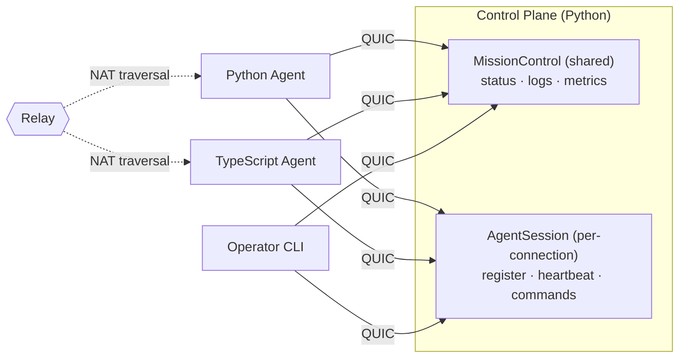

# Mission Control

> You need two services to talk. So you set up a load balancer, provision
> TLS certs, write protobuf schemas, compile them, configure a service mesh,
> deploy to Kubernetes, and pray the health checks converge before the
> demo tomorrow.
>
> Or: you write one Python file and run it.

```python
@service(name="MissionControl", version=1)
class MissionControl:
    @rpc()
    async def getStatus(self, req: StatusRequest) -> StatusResponse:
        return StatusResponse(agent_id=req.agent_id, status="running")
```

```bash
python control.py          # that's the server
aster shell aster1Qm...   # that's the client — tab completion, typed responses
```

No YAML. No protobuf compilation. No port numbers. No cloud account.
Encrypted, authenticated, works across NATs, and your TypeScript
colleague can call it too.

This guide builds **Mission Control** — a control plane for managing
remote agents. An agent could be a CI runner, an IoT sensor, an AI
worker, or a service on your colleague's laptop across the world.

In under an hour you'll have:
- Agents that check in, push metrics, and stream logs
- Operators that watch, issue commands, and control access
- A TypeScript agent talking to the Python control plane

Everything runs peer-to-peer. No infrastructure beyond a relay for
NAT traversal (self-hostable). Once peers find each other, traffic
flows direct.



> Aster uses [Iroh's public relays](https://iroh.computer) for discovery
> and NAT traversal by default. Point to your own with a single
> environment variable: `IROH_RELAY_URL=https://relay.yourcompany.com`.

---

## Chapter 1: Your First Agent Check-In (5 min)

**Goal:** The full working version of what you just saw — define a service,
start it, call it.

```python
# control.py
from dataclasses import dataclass
from aster import AsterServer, service, rpc, wire_type

@wire_type("mission/StatusRequest")
@dataclass
class StatusRequest:
    agent_id: str = ""

@wire_type("mission/StatusResponse")
@dataclass
class StatusResponse:
    agent_id: str = ""
    status: str = "idle"
    uptime_secs: int = 0

@service(name="MissionControl", version=1)
class MissionControl:
    @rpc()
    async def getStatus(self, req: StatusRequest) -> StatusResponse:
        return StatusResponse(
            agent_id=req.agent_id,
            status="running",
            uptime_secs=3600,
        )

async def main():
    async with AsterServer(services=[MissionControl()]) as srv:
        print(srv.ticket)       # compact aster1... address
        await srv.serve()

if __name__ == "__main__":
    import asyncio
    asyncio.run(main())
```

```bash
# Terminal 1: start the control plane
python control.py
# → Ticket: aster1Qm...

# Terminal 2: connect and inspect
aster shell aster1Qm...
> cd services/MissionControl
> ./getStatus agent_id="edge-node-7"
```

Or skip the shell entirely — call it straight from the command line:

```bash
aster call aster1Qm... MissionControl.getStatus '{"agent_id": "edge-node-7"}' --json
```

**What just happened:**
- `@service` + `@rpc` defined a typed RPC contract
- `@wire_type` made the types serializable across languages — no `.proto`
  files, no separate schema to maintain
- `AsterServer` created an encrypted QUIC endpoint and started listening —
  clients discover the service contract on connect
- `aster shell` connected, discovered the service, and invoked it — with
  tab completion and typed responses
- `aster call` invoked it non-interactively — Aster isn't just a library,
  it's a platform with a first-class CLI

---

## Chapter 2: Live Log Streaming (5 min)

**Goal:** Agents push logs into the control plane. Operators tail them
in real time using server streaming.

```python
@wire_type("mission/LogEntry")
@dataclass
class LogEntry:
    timestamp: float = 0.0
    level: str = "info"
    message: str = ""
    agent_id: str = ""

@wire_type("mission/TailRequest")
@dataclass
class TailRequest:
    agent_id: str = ""
    level: str = "info"    # minimum level filter

@service(name="MissionControl", version=1)
class MissionControl:
    def __init__(self):
        self._log_queue = asyncio.Queue()   # just a regular Python queue

    # ... getStatus from Chapter 1 ...

    @rpc()
    async def submitLog(self, entry: LogEntry) -> None:
        """Agents call this to push log entries."""
        await self._log_queue.put(entry)

    @server_stream()
    async def tailLogs(self, req: TailRequest):
        """Stream log entries as they arrive."""
        while True:
            entry = await self._log_queue.get()
            if req.agent_id and entry.agent_id != req.agent_id:
                continue
            if _level_rank(entry.level) < _level_rank(req.level):
                continue
            yield entry
```

```bash
# In the shell:
> ./tailLogs agent_id="edge-node-7" level="warn"
#0 {"timestamp": 1712567890.1, "level": "warn", "message": "disk 92% full", ...}
#1 {"timestamp": 1712567891.3, "level": "error", "message": "health check failed", ...}
# Ctrl+C to stop
```

**What just happened:**
- `@server_stream` turns an async generator into a streaming RPC
- The client receives items as they're yielded — no polling, no websockets
- Under the hood: a single QUIC stream, with Aster framing, flowing until
  either side closes it
- Agents push entries via `submitLog` — it's just a regular `asyncio.Queue`
  under the hood. Aster services are plain Python classes with plain state

---

## Chapter 3: Metric Ingestion (5 min)

**Goal:** Agents push thousands of metric datapoints per second using
client streaming.

```python
@wire_type("mission/MetricPoint")
@dataclass
class MetricPoint:
    name: str = ""
    value: float = 0.0
    timestamp: float = 0.0
    tags: dict = field(default_factory=dict)

@wire_type("mission/IngestResult")
@dataclass
class IngestResult:
    accepted: int = 0
    dropped: int = 0

@service(name="MissionControl", version=1)
class MissionControl:
    # ... previous methods ...

    @client_stream()
    async def ingestMetrics(self, stream) -> IngestResult:
        """Receive a stream of metric points from an agent."""
        accepted = 0
        async for point in stream:
            self._store_metric(point)
            accepted += 1
        return IngestResult(accepted=accepted)
```

On the agent side, we'll start with a **proxy client** — quick to set up,
no types needed on the consumer side:

```python
# agent.py — proxy client (good for prototyping)
from aster import AsterClient

async with AsterClient(endpoint_addr="aster1Qm...") as client:
    mc = client.proxy("MissionControl")
    
    # Stream 10,000 metrics — the proxy accepts dicts
    async def metrics():
        for i in range(10_000):
            yield {"name": "cpu.usage", "value": random(), "timestamp": time()}
    
    result = await mc.ingestMetrics(metrics())
    print(f"Accepted: {result['accepted']}")
```

The proxy client discovers methods from the contract and sends dicts over
the wire. Great for scripting, prototyping, and generic gateways — if
you're building a dashboard that talks to any Aster service without
knowing its types at compile time, the proxy is your best friend.

> **Proxy vs Typed client** — For production, import the same types the
> producer uses and swap `client.proxy(...)` for `create_client(...)`:
>
> ```python
> from aster import create_client
> mc = create_client(MissionControl, client.transport("MissionControl"))
> result = await mc.ingestMetrics(metric_stream())   # IDE autocomplete, type checking
> print(result.accepted)                              # not result['accepted']
> ```
>
> Same wire protocol, same contract — just with type safety. Use the proxy
> for scripts and exploration, the typed client for production services.

**What just happened:**
- Client streaming sends many messages, gets one response at the end
- The producer processes items as they arrive — no buffering the entire batch
- The proxy client requires no type imports — it reads the contract from
  the producer and builds method stubs dynamically
- This is how you'd build telemetry ingestion, log shipping, or bulk data upload

---

## Chapter 4: Agent Sessions & Remote Commands (5 min)

**Goal:** Each agent gets its own session — register, heartbeat, and
execute commands. This is where per-agent state and bidi streaming meet.

`MissionControl` is a shared service — one instance, all clients see the
same state. But each agent needs its own identity, capabilities, and
command channel. That's a session-scoped service:

```python
@wire_type("mission/Heartbeat")
@dataclass
class Heartbeat:
    agent_id: str = ""
    capabilities: list = field(default_factory=list)   # ["gpu", "arm64", ...]
    load_avg: float = 0.0

@wire_type("mission/Assignment")
@dataclass
class Assignment:
    task_id: str = ""
    command: str = ""

@wire_type("mission/Command")
@dataclass
class Command:
    command: str = ""

@wire_type("mission/CommandResult")
@dataclass
class CommandResult:
    stdout: str = ""
    stderr: str = ""
    exit_code: int = -1    # -1 means still running

@service(name="AgentSession", version=1, scoped="session")
class AgentSession:
    """Session-scoped: one instance per connected agent."""

    def __init__(self):
        self._agent_id = ""
        self._capabilities = []

    @rpc()
    async def register(self, hb: Heartbeat) -> Assignment:
        """Agent announces itself and gets an assignment."""
        self._agent_id = hb.agent_id
        self._capabilities = hb.capabilities
        if "gpu" in hb.capabilities:
            return Assignment(task_id="train-42", command="python train.py")
        return Assignment(task_id="idle", command="sleep 60")

    @rpc()
    async def heartbeat(self, hb: Heartbeat) -> Assignment:
        """Periodic check-in — update load, maybe get new work."""
        self._capabilities = hb.capabilities
        return Assignment(task_id="continue", command="")

    @bidi_stream()
    async def runCommand(self, commands):
        """Execute commands on this agent — stream in, results stream back."""
        async for cmd in commands:
            proc = await asyncio.create_subprocess_shell(
                cmd.command,
                stdout=asyncio.subprocess.PIPE,
                stderr=asyncio.subprocess.PIPE,
            )
            stdout, stderr = await proc.communicate()
            yield CommandResult(
                stdout=stdout.decode(),
                stderr=stderr.decode(),
                exit_code=proc.returncode,
            )
```

```bash
# Operator connects and runs commands on a specific agent's session:
aster shell aster1Qm...
> cd services/AgentSession
> ./runCommand
bidi> command="df -h"
← {"stdout": "Filesystem  Size  Used ...", "exit_code": 0}
bidi> command="uptime"
← {"stdout": " 14:32  up 3 days ...", "exit_code": 0}
> end
```

**What just happened:**
- `scoped="session"` creates a fresh `AgentSession` per connection — each
  agent gets its own identity, capabilities, and command channel
- `runCommand` uses bidi streaming: commands flow in, results flow back,
  all on a single multiplexed QUIC stream
- State like `self._agent_id` is private to that agent's session — no
  hand-rolled connection maps
- When the agent disconnects, the session is cleaned up automatically

Two service types, two different lifetimes:
- **`MissionControl`** (shared) — fleet-wide: status, logs, metrics
- **`AgentSession`** (session) — per-agent: register, heartbeat, commands

---

## Chapter 5: Auth & Capabilities (5 min)

**Goal:** Not every caller should be able to deploy or run commands on agents.
Define roles, compose requirements, and issue scoped credentials.

### Step 1: Generate a root key

The root key is the trust anchor for your entire deployment. Keep it
offline — you'll use it to sign credentials, not to run services.

```bash
# One-time setup — generates an Ed25519 keypair
aster trust keygen --output ~/.aster/root.key

# Output:
# Root key generated: ~/.aster/root.key
# Public key: ed25519:b3a4f1...
# ⚠ Store this key securely — it controls who can join your network
```

### Step 2: Define roles in code

```python
from enum import Enum
from aster import any_of, all_of

class Role(str, Enum):
    """Capabilities that can be granted to consumers."""
    STATUS  = "ops.status"      # read service status
    LOGS    = "ops.logs"        # tail live logs
    ADMIN   = "ops.admin"       # run commands on agents
    INGEST  = "ops.ingest"      # push metrics (agents)
```

Apply requirements to methods. Simple cases take a single role;
complex cases compose with `any_of` / `all_of`:

```python
@service(name="MissionControl", version=1)
class MissionControl:

    @rpc(requires=Role.STATUS)
    async def getStatus(self, req: StatusRequest) -> StatusResponse: ...

    @server_stream(requires=any_of(Role.LOGS, Role.ADMIN))
    async def tailLogs(self, req: TailRequest):
        """Log access for log viewers OR admins — either role works."""
        ...

    @client_stream(requires=Role.INGEST)
    async def ingestMetrics(self, stream) -> IngestResult:
        """Agents push metrics — scoped to the ingest role."""
        ...

@service(name="AgentSession", version=1, scoped="session")
class AgentSession:

    @rpc(requires=Role.INGEST)
    async def register(self, hb: Heartbeat) -> Assignment: ...

    @bidi_stream(requires=Role.ADMIN)
    async def runCommand(self, commands):
        """Command execution is admin-only."""
        ...
```

### Step 3: Start the control plane with auth

```python
config = AsterConfig(
    root_pubkey_file="~/.aster/root.key",
    allow_all_consumers=False,   # require credentials
)
async with AsterServer(
    services=[MissionControl(), AgentSession()],
    config=config,
) as srv:
    print(srv.ticket)
    await srv.serve()
```

### Step 4: Enroll agents

```bash
# Issue a credential for an edge agent — status and ingest only
aster enroll consumer --name "edge-node-7" \
    --capabilities ops.status,ops.ingest \
    --root-key ~/.aster/root.key \
    --output edge-node-7.cred

# Issue an operator credential — full access including admin
aster enroll consumer --name "ops-team" \
    --capabilities ops.status,ops.logs,ops.admin,ops.ingest \
    --root-key ~/.aster/root.key \
    --output ops-team.cred
```

### Step 5: Connect with credentials

```python
# agent.py — connecting with a scoped credential
async with AsterClient(
    endpoint_addr="aster1Qm...",
    credential_file="edge-node-7.cred",
) as client:
    mc = client.proxy("MissionControl")
    agent = client.proxy("AgentSession")
    
    await mc.getStatus(...)        # ✓ has ops.status
    await mc.ingestMetrics(...)    # ✓ has ops.ingest
    await agent.runCommand(...)    # ✗ AccessDenied — missing ops.admin
```

```bash
# Or from the CLI — the shell respects credentials too
aster shell aster1Qm... --credential ops-team.cred
> cd services/AgentSession
> ./runCommand               # ✓ ops-team has ops.admin
```

**What just happened:**
- `aster trust keygen` created the root of trust — one command
- `aster enroll consumer` issued scoped credentials — no CA infrastructure
- `requires=Role.ADMIN` — Aster checks at the method level, no auth middleware to write
- `any_of(A, B)` — caller must have at LEAST ONE (log viewers OR admins can tail)
- The edge agent can push metrics but can't run commands. The ops team can do both.
  That's the entire access control model — defined in code, enforced at the wire level

---

## Chapter 6: Publishing Your Service (5 min)

**Goal:** Share your service with your team so anyone can discover and
connect to it.

So far you've been passing around tickets — those `aster1Qm...` strings.
That works for development, but when your teammate asks "how do I
connect to Mission Control?", you want a better answer.

```bash
# Publish to the Aster registry
aster publish --name yourteam/MissionControl

# Output:
# Published: yourteam/MissionControl v1
# Contract hash: blake3:a7f2c1...
# Consumers can connect with:
#   aster shell yourteam/MissionControl
```

Now anyone on your team can:

```bash
# Connect by name — no ticket needed
aster shell yourteam/MissionControl
> cd services/MissionControl
> ./getStatus agent_id="edge-node-7"
```

They can also inspect the contract before writing a single line of code:

```bash
# See what's available
aster contract inspect yourteam/MissionControl

# Output:
# MissionControl v1 (blake3:a7f2c1...)
# ├── getStatus(StatusRequest) → StatusResponse          [rpc]
# ├── tailLogs(TailRequest) → stream LogEntry            [server_stream]
# └── ingestMetrics(stream MetricPoint) → IngestResult   [client_stream]
#
# AgentSession v1 (blake3:e3b0c4...)  [session-scoped]
# ├── register(Heartbeat) → Assignment                   [rpc]
# ├── heartbeat(Heartbeat) → Assignment                  [rpc]
# └── runCommand(stream Command) ↔ stream CommandResult  [bidi_stream]
```

And generate a typed client in their language:

```bash
# Generate TypeScript types + client from the published contract
aster contract gen yourteam/MissionControl --lang typescript --output ./generated/

# Output:
# Generated: ./generated/mission-control.ts
#   - 6 wire types
#   - 2 service clients (MissionControl, AgentSession)
```

**What just happened:**
- `aster publish` gave your service a human-readable name backed by a
  content-addressed contract hash — the name is convenient, the hash is
  the source of truth
- `aster contract inspect` lets consumers explore the API without reading
  your source code
- `aster contract gen` produces typed clients in any supported language —
  no shared repo, no protobuf files, no copy-pasting type definitions

---

## Chapter 7: Cross-Language — TypeScript Agent (5 min)

**Goal:** Your teammate wants to send metrics from their TypeScript
application. They don't have your Python source — just the published
contract.

Using the generated client from Chapter 6:

```typescript
// agent.ts — using the generated types
import { AsterClient, createClient } from '@aster-rpc/aster';
import { MissionControl, AgentSession, Heartbeat, MetricPoint } from './generated/mission-control';

const client = new AsterClient({ endpoint: "yourteam/MissionControl" });
await client.connect();

// Typed clients — same pattern as Python's create_client()
const session = createClient(AgentSession, client.transport("AgentSession"));
const assignment = await session.register(
  new Heartbeat({ agentId: "ts-worker-1", capabilities: ["gpu", "arm64"] })
);
console.log(`Assigned: ${assignment.taskId}`);

// Stream metrics from TypeScript to the Python control plane
const mc = createClient(MissionControl, client.transport("MissionControl"));
const result = await mc.ingestMetrics(async function*() {
  for (let i = 0; i < 1000; i++) {
    yield new MetricPoint({ name: "gpu.temp", value: 72 + Math.random() * 10 });
  }
}());
console.log(`Accepted: ${result.accepted}`);
```

Or if they just want to explore first — no codegen needed:

```typescript
// Quick and dirty — proxy client, no generated types
const mc = client.proxy("MissionControl");
const status = await mc.getStatus({ agentId: "ts-worker-1" });
```

**What just happened:**
- Your teammate never saw your Python source code
- `aster contract gen` gave them typed clients generated from the
  published contract — full autocomplete, type checking, no guesswork
- Same wire format, same contract hash — the Python producer and
  TypeScript consumer agree on the protocol without sharing a repo
- The proxy client is still there for quick exploration

> **"But there's no .proto file — how does TypeScript know what Python
> sent?"** — The `@wire_type` decorator registers each type's schema in
> Aster's content-addressed registry. `aster contract gen` pulls that
> metadata and generates native types in any supported language. The
> registry is the shared schema — you just never had to write it by hand.

---

## Appendix: Running the Benchmarks

```bash
cd examples/mission-control
python bench/benchmark.py

# Example output (local loopback, Apple M2, illustrative):
# ┌─────────────────────────────────┐
# │ Mission Control Benchmark       │
# ├──────────────┬──────────────────┤
# │ Unary        │ 12,400 req/s     │
# │ Server stream│ 48,000 msg/s     │
# │ Client stream│ 52,000 msg/s     │
# │ Bidi stream  │ 31,000 msg/s     │
# │ Latency p50  │ 0.08 ms          │
# │ Latency p99  │ 0.34 ms          │
# └──────────────┴──────────────────┘
```

---

## What's Next?

You just built a working control plane with four RPC patterns, session-scoped
agents, capability-based auth, published discovery, and cross-language
interop. That's a real system — not a demo.

There's more to Aster that you didn't need today but will want in
production: built-in observability, load balancing, fail-over, and
high availability — all on a distributed foundation using
content-addressed data, CRDTs, and gossip protocols.

Next guides in the series:
- **Hardening for Production** — interceptors for retry, circuit-breaking,
  rate limiting, and deadlines
- **Scaling Out** — multiple producers with automatic fail-over
- **Artifact Distribution** — push builds and model weights to agents
  with content-addressed blobs
- **Shared Fleet State** — CRDT documents that sync across your fleet

The full source for this example is in `examples/mission-control/`.
