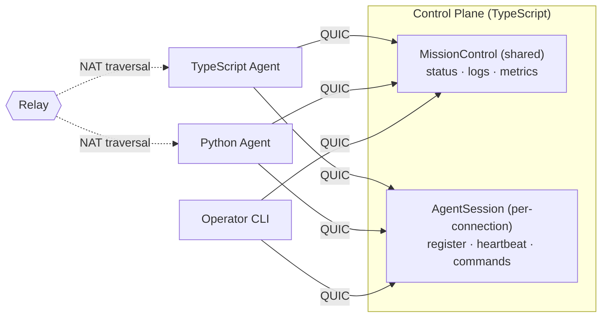

# Mission Control

> You need two services to talk. So you set up a load balancer, provision
> TLS certs, write protobuf schemas, compile them, configure a service mesh,
> deploy to Kubernetes, and pray the health checks converge before the
> demo tomorrow.
>
> Or: you write one TypeScript file and run it.

```typescript
@Service({ name: "MissionControl", version: 1 })
class MissionControl {
    @Rpc()
    async getStatus(req: StatusRequest): Promise<StatusResponse> {
        return new StatusResponse({ agent_id: req.agent_id, status: "running" });
    }
}
```

```bash
bun run control.ts             # that's the server
aster shell aster1Qm...       # that's the client — tab completion, typed responses
```

No YAML. No protobuf compilation. No port numbers. No cloud account.
Encrypted, authenticated, works across NATs, and your Python
colleague can call it too.

**What you're replacing:** Traditional RPC means writing `.proto` files,
compiling them, setting up TLS certificates, configuring a reverse proxy
or service mesh so clients can find your service, managing certificate
rotation, and repeating all of that for every new service. With Aster you
get mTLS-grade mutual authentication (no CA infrastructure), gRPC-style
streaming RPCs (no `.proto` compilation), and peer-to-peer connectivity
(no port forwarding or load balancers). Your Python teammate calls your
TypeScript service without installing anything from your repo.

This guide builds **Mission Control** — a control plane for managing
remote agents. An agent could be a CI runner, an IoT sensor, an AI
worker, or a service on your colleague's laptop across the world.

In under an hour you'll have:
- Agents that check in, push metrics, and stream logs
- Operators that watch, issue commands, and control access
- A Python agent talking to the TypeScript control plane

Everything runs peer-to-peer. No infrastructure beyond a relay for
NAT traversal (self-hostable). Once peers find each other, traffic
flows direct.



> Aster uses [Iroh's public relays](https://iroh.computer) for discovery
> and NAT traversal by default. Point to your own with a single
> environment variable: `IROH_RELAY_URL=https://relay.yourcompany.com`.

---

## Chapter 1: Your First Agent Check-In (5 min)

**Goal:** The full working version of what you just saw — define a service,
start it, call it.

```typescript
// control.ts
import { AsterServer, Service, Rpc, WireType } from '@aster-rpc/aster';

@WireType("mission/StatusRequest")
class StatusRequest {
    agent_id: string = "";
    constructor(init?: Partial<StatusRequest>) { if (init) Object.assign(this, init); }
}

@WireType("mission/StatusResponse")
class StatusResponse {
    agent_id: string = "";
    status: string = "idle";
    uptime_secs: number = 0;
    constructor(init?: Partial<StatusResponse>) { if (init) Object.assign(this, init); }
}

@Service({ name: "MissionControl", version: 1 })
class MissionControl {
    @Rpc()
    async getStatus(req: StatusRequest): Promise<StatusResponse> {
        return new StatusResponse({
            agent_id: req.agent_id,
            status: "running",
            uptime_secs: 3600,
        });
    }
}

async function main() {
    const server = new AsterServer({ services: [new MissionControl()] });
    await server.start();
    console.log(server.address);       // compact aster1... address
    await server.serve();
}

main();
```

```bash
# Terminal 1: start the control plane
bun run control.ts
# → aster1Qm...

# Terminal 2: connect and inspect
aster shell aster1Qm...
> cd services/MissionControl
> ./getStatus agent_id="edge-node-7"
```

Or skip the shell entirely -- call it straight from the command line:

```bash
aster call aster1Qm... MissionControl.getStatus '{"agent_id": "edge-node-7"}'
```

> **`aster shell` vs `aster call`:** Use `aster shell` for interactive
> exploration -- browsing services, tab-completing methods, streaming.
> Use `aster call` for scripting and one-shot invocations. Both use
> JSON serialization under the hood. For production code, use generated
> typed clients (Chapter 6).

**What just happened:**
- `@Service` + `@Rpc` defined a typed RPC contract
- `@WireType` made the types serializable across languages — no `.proto`
  files, no separate schema to maintain
- `AsterServer` created an encrypted QUIC endpoint and started listening —
  clients discover the service contract on connect
- `aster shell` connected, discovered the service, and invoked it — with
  tab completion and typed responses
- `aster call` invoked it non-interactively — Aster isn't just a library,
  it's a platform with a first-class CLI

---

## Chapter 2: Live Log Streaming (5 min)

**Goal:** Agents push logs into the control plane. Operators tail them
in real time using server streaming.

```typescript
import { ServerStream } from '@aster-rpc/aster';

@WireType("mission/LogEntry")
class LogEntry {
    timestamp: number = 0.0;
    level: string = "info";
    message: string = "";
    agent_id: string = "";
    constructor(init?: Partial<LogEntry>) { if (init) Object.assign(this, init); }
}

@WireType("mission/SubmitLogResult")
class SubmitLogResult {
    accepted: boolean = true;
    constructor(init?: Partial<SubmitLogResult>) { if (init) Object.assign(this, init); }
}

@WireType("mission/TailRequest")
class TailRequest {
    agent_id: string = "";
    level: string = "info";    // minimum level filter
    constructor(init?: Partial<TailRequest>) { if (init) Object.assign(this, init); }
}

@Service({ name: "MissionControl", version: 1 })
class MissionControl {
    private _logBuffer: LogEntry[] = [];
    private _logResolve: ((entry: LogEntry) => void) | null = null;

    // ... getStatus from Chapter 1 ...

    @Rpc()
    async submitLog(entry: LogEntry): Promise<SubmitLogResult> {
        /** Agents call this to push log entries. */
        if (this._logResolve) {
            this._logResolve(entry);
            this._logResolve = null;
        } else {
            this._logBuffer.push(entry);
        }
        return new SubmitLogResult();
    }

    @ServerStream()
    async *tailLogs(req: TailRequest): AsyncGenerator<LogEntry> {
        /** Stream log entries as they arrive. */
        while (true) {
            const entry = this._logBuffer.length > 0
                ? this._logBuffer.shift()!
                : await new Promise<LogEntry>(resolve => { this._logResolve = resolve; });
            if (req.agent_id && entry.agent_id !== req.agent_id) continue;
            if (levelRank(entry.level) < levelRank(req.level)) continue;
            yield entry;
        }
    }
}
```

```bash
# In the shell:
> ./tailLogs agent_id="edge-node-7" level="warn"
#0 {"timestamp": 1712567890.1, "level": "warn", "message": "disk 92% full", ...}
#1 {"timestamp": 1712567891.3, "level": "error", "message": "health check failed", ...}
# Ctrl+C to stop
```

> **Tip:** `tailLogs` blocks until a log entry arrives. If the buffer is
> empty, the client waits. Submit a log entry from another terminal
> (or via `aster call ... MissionControl.submitLog '{"message":"test"}'`)
> to see it appear in the stream. Press Ctrl+C to stop.

**What just happened:**
- `@ServerStream` turns an async generator into a streaming RPC
- The client receives items as they're yielded -- no polling, no websockets
- Under the hood: a single QUIC stream, with Aster framing, flowing until
  either side closes it
- Agents push entries via `submitLog` -- a simple buffer + promise under
  the hood. Aster services are plain TypeScript classes with plain state

---

## Chapter 3: Metric Ingestion (5 min)

**Goal:** Agents push thousands of metric datapoints per second using
client streaming.

```typescript
import { ClientStream } from '@aster-rpc/aster';

@WireType("mission/MetricPoint")
class MetricPoint {
    name: string = "";
    value: number = 0.0;
    timestamp: number = 0.0;
    tags: Record<string, string> = {};
    constructor(init?: Partial<MetricPoint>) { if (init) Object.assign(this, init); }
}

@WireType("mission/IngestResult")
class IngestResult {
    accepted: number = 0;
    dropped: number = 0;
    constructor(init?: Partial<IngestResult>) { if (init) Object.assign(this, init); }
}

@Service({ name: "MissionControl", version: 1 })
class MissionControl {
    // ... previous methods ...

    @ClientStream()
    async ingestMetrics(stream: AsyncIterable<MetricPoint>): Promise<IngestResult> {
        /** Receive a stream of metric points from an agent. */
        let accepted = 0;
        for await (const point of stream) {
            this.storeMetric(point);
            accepted += 1;
        }
        return new IngestResult({ accepted });
    }
}
```

On the agent side, we'll start with a **proxy client** — quick to set up,
no types needed on the consumer side:

```typescript
// agent.ts — proxy client (good for prototyping)
import { AsterClientWrapper, IrohTransport } from '@aster-rpc/aster';

async function main() {
    const client = new AsterClientWrapper({ address: "aster1Qm..." });
    await client.connect();
    const mc = client.proxy("MissionControl");

    // Stream 10,000 metrics — the proxy accepts plain objects
    async function* metrics() {
        for (let i = 0; i < 10_000; i++) {
            yield { name: "cpu.usage", value: Math.random(), timestamp: Date.now() / 1000 };
        }
    }

    const result = await mc.ingestMetrics(metrics());
    console.log(`Accepted: ${result.accepted}`);

    await client.close();
}

main();
```

The proxy client discovers methods from the contract and sends plain objects
over the wire. Great for scripting, prototyping, and generic gateways — if
you're building a dashboard that talks to any Aster service without
knowing its types at compile time, the proxy is your best friend.

> **Proxy vs Typed client** — For production, generate a typed client
> with `aster contract gen-client` and use `fromConnection()`:
>
> ```typescript
> import { MissionControlClient } from './mission_control/services/mission_control_v1';
> const mc = await MissionControlClient.fromConnection(client);
> const result = await mc.ingestMetrics(metricStream());   // IDE autocomplete, type checking
> console.log(result.accepted);                             // typed, not result['accepted']
> ```
>
> Same wire protocol, same contract — just with type safety. Use the proxy
> for scripts and exploration, the generated client for production services.

**What just happened:**
- Client streaming sends many messages, gets one response at the end
- The producer processes items as they arrive — no buffering the entire batch
- The proxy client requires no type imports — it reads the contract from
  the producer and builds method stubs dynamically
- This is how you'd build telemetry ingestion, log shipping, or bulk data upload

---

## Chapter 4: Agent Sessions & Remote Commands (5 min)

**Goal:** Each agent gets its own session — register, heartbeat, and
execute commands. This is where per-agent state and bidi streaming meet.

`MissionControl` is a shared service — one instance, all clients see the
same state. But each agent needs its own identity, capabilities, and
command channel. That's a session-scoped service:

```typescript
import { BidiStream } from '@aster-rpc/aster';
import { exec } from 'child_process';
import { promisify } from 'util';
const execAsync = promisify(exec);

@WireType("mission/Heartbeat")
class Heartbeat {
    agent_id: string = "";
    capabilities: string[] = [];   // ["gpu", "arm64", ...]
    load_avg: number = 0.0;
    constructor(init?: Partial<Heartbeat>) { if (init) Object.assign(this, init); }
}

@WireType("mission/Assignment")
class Assignment {
    task_id: string = "";
    command: string = "";
    constructor(init?: Partial<Assignment>) { if (init) Object.assign(this, init); }
}

@WireType("mission/Command")
class Command {
    command: string = "";
    constructor(init?: Partial<Command>) { if (init) Object.assign(this, init); }
}

@WireType("mission/CommandResult")
class CommandResult {
    stdout: string = "";
    stderr: string = "";
    exit_code: number = -1;    // -1 means still running
    constructor(init?: Partial<CommandResult>) { if (init) Object.assign(this, init); }
}

@Service({ name: "AgentSession", version: 1, scoped: "session" })
class AgentSession {
    /** Session-scoped: one instance per connected agent. */
    private _peer: string | null;
    private _agent_id: string = "";
    private _capabilities: string[] = [];

    constructor(peer?: string) {
        this._peer = peer ?? null;
    }

    @Rpc()
    async register(hb: Heartbeat): Promise<Assignment> {
        /** Agent announces itself and gets an assignment. */
        this._agent_id = hb.agent_id;
        this._capabilities = hb.capabilities;
        if (hb.capabilities.includes("gpu")) {
            return new Assignment({ task_id: "train-42", command: "python train.py" });
        }
        return new Assignment({ task_id: "idle", command: "sleep 60" });
    }

    @Rpc()
    async heartbeat(hb: Heartbeat): Promise<Assignment> {
        /** Periodic check-in — update load, maybe get new work. */
        this._capabilities = hb.capabilities;
        return new Assignment({ task_id: "continue", command: "" });
    }

    @BidiStream()
    async *runCommand(commands: AsyncIterable<Command>): AsyncGenerator<CommandResult> {
        /** Execute commands on this agent — stream in, results stream back. */
        for await (const cmd of commands) {
            try {
                const { stdout, stderr } = await execAsync(cmd.command);
                yield new CommandResult({
                    stdout,
                    stderr,
                    exit_code: 0,
                });
            } catch (err: any) {
                yield new CommandResult({
                    stdout: err.stdout ?? "",
                    stderr: err.stderr ?? err.message,
                    exit_code: err.code ?? 1,
                });
            }
        }
    }
}
```

```bash
# Operator connects and opens a session subshell:
aster shell aster1Qm...
> cd services
> session AgentSession
# prompt becomes "AgentSession~" — you're now in a dedicated session.
# State persists across calls; the same instance handles every method.
AgentSession~ register agent_id="edge-7" capabilities='["gpu"]'
← {"agent_id": "edge-7", "task": "train-42"}
AgentSession~ runCommand command="df -h"
← {"stdout": "Filesystem  Size  Used ...", "exit_code": 0}
AgentSession~ runCommand command="uptime"
← {"stdout": " 14:32  up 3 days ...", "exit_code": 0}
AgentSession~ end
```

> **Why a session subshell?** Session-scoped services hold per-connection
> state. If you tried `./runCommand` directly from `/services/AgentSession`,
> the shell would open a new stream per call and tear down the state
> between them. The `session` command opens one persistent session and
> routes every method through it. The `AgentSession~` prompt makes it
> obvious you're inside a stateful session. Type `end` to close it.

**What just happened:**
- `scoped: "session"` creates a fresh `AgentSession` per connection — each
  agent gets its own identity, capabilities, and command channel
- `runCommand` uses bidi streaming: commands flow in, results flow back,
  all on a single multiplexed QUIC stream
- State like `this._agent_id` is private to that agent's session — no
  hand-rolled connection maps
- When the agent disconnects, the session is cleaned up automatically

Two service types, two different lifetimes:
- **`MissionControl`** (shared) — fleet-wide: status, logs, metrics
- **`AgentSession`** (session) — per-agent: register, heartbeat, commands

---

## Chapter 5: Auth & Capabilities (5 min)

**Goal:** Not every caller should be able to deploy or run commands on agents.
Define roles, compose requirements, and issue scoped credentials.

The auth flow has three steps:
1. **Define** -- declare which capabilities each method requires (in code)
2. **Issue** -- create credentials with specific capabilities (CLI)
3. **Connect** -- present the credential on connect; the framework enforces access

The credential carries an `aster.role` attribute with a comma-separated
list of capabilities. The server's `CapabilityInterceptor` checks this
list against each method's `requires` declaration. No middleware to
write, no token parsing -- it's declarative.

### Step 1: Generate a root key

The root key is the trust anchor for your entire deployment. Keep it
offline — you'll use it to sign credentials, not to run services.

```bash
# One-time setup — generates an Ed25519 keypair
aster trust keygen --out-key ~/.aster/root.key

# Output:
# Root private key written to: ~/.aster/root.key
# Root public key written to:  ~/.aster/root.pub
# Public key: b3a4f1...
# Keep root.key secret. Share root.pub with nodes that need to verify credentials.
```

### Step 2: Define roles in code

```typescript
import { anyOf, allOf } from '@aster-rpc/aster';

/** Capabilities that can be granted to consumers. */
const Role = {
    STATUS:  "ops.status",      // read service status
    LOGS:    "ops.logs",        // tail live logs
    ADMIN:   "ops.admin",       // run commands on agents
    INGEST:  "ops.ingest",      // push metrics (agents)
} as const;
```

Apply requirements to methods. Simple cases take a single role;
complex cases compose with `anyOf` / `allOf`:

```typescript
@Service({ name: "MissionControl", version: 1 })
class MissionControl {

    @Rpc({ requires: Role.STATUS })
    async getStatus(req: StatusRequest): Promise<StatusResponse> { ... }

    @ServerStream({ requires: anyOf(Role.LOGS, Role.ADMIN) })
    async *tailLogs(req: TailRequest): AsyncGenerator<LogEntry> {
        /** Log access for log viewers OR admins — either role works. */
        ...
    }

    @ClientStream({ requires: Role.INGEST })
    async ingestMetrics(stream: AsyncIterable<MetricPoint>): Promise<IngestResult> {
        /** Agents push metrics — scoped to the ingest role. */
        ...
    }
}

@Service({ name: "AgentSession", version: 1, scoped: "session" })
class AgentSession {

    @Rpc({ requires: Role.INGEST })
    async register(hb: Heartbeat): Promise<Assignment> { ... }

    @BidiStream({ requires: Role.ADMIN })
    async *runCommand(commands: AsyncIterable<Command>): AsyncGenerator<CommandResult> {
        /** Command execution is admin-only. */
        ...
    }
}
```

### Step 3: Start the control plane with auth

```typescript
const server = new AsterServer({
    services: [new MissionControl(), new AgentSession()],
    identity: ".aster-identity",
    peer: "mission-control",
    config: {
        rootPubkeyFile: "~/.aster/root.pub",
    },
    allowAllConsumers: false,   // require credentials
});
await server.start();
console.log(server.address);
await server.serve();
```

### Step 4: Enroll agents

```bash
# Issue a credential for an edge agent -- status and ingest only
aster enroll node --role consumer --name "edge-node-7" \
    --capabilities ops.status,ops.ingest \
    --root-key ~/.aster/root.key \
    --out edge-node-7.cred

# Issue an operator credential -- full access including admin
aster enroll node --role consumer --name "ops-team" \
    --capabilities ops.status,ops.logs,ops.admin,ops.ingest \
    --root-key ~/.aster/root.key \
    --out ops-team.cred
```

### Step 5: Connect with credentials

```typescript
// agent.ts — connecting with a scoped credential
import { AsterClientWrapper } from '@aster-rpc/aster';

async function main() {
    const client = new AsterClientWrapper({
        address: "aster1Qm...",
        enrollmentCredentialFile: "edge-node-7.cred",
    });
    await client.connect();
    const mc = client.proxy("MissionControl");
    const agent = client.proxy("AgentSession");

    await mc.getStatus({ agent_id: "test" });     // OK — has ops.status
    await mc.ingestMetrics(...);                   // OK — has ops.ingest
    // await agent.runCommand(...);                // AccessDenied — missing ops.admin

    await client.close();
}

main();
```

```bash
# Or from the CLI — the shell respects credentials too
aster shell aster1Qm... --rcan ops-team.cred
> cd services
> session AgentSession                 # opens session subshell
AgentSession~ runCommand command="df"  # ✓ ops-team has ops.admin
```

**What just happened:**
- `aster trust keygen` created the root of trust — one command
- `aster enroll node --role consumer` issued scoped credentials — no CA infrastructure
- `requires: Role.ADMIN` — Aster checks at the method level, no auth middleware to write
- `anyOf(A, B)` — caller must have at LEAST ONE (log viewers OR admins can tail)
- The edge agent can push metrics but can't run commands. The ops team can do both.
  That's the entire access control model — defined in code, enforced at the wire level

---

## Chapter 6: Generating Typed Clients (5 min)

**Goal:** Your teammate wants to write a TypeScript script that calls Mission
Control — without importing your source code. Generate a typed client
directly from the running service.

So far you've been using the shell to explore. But for production code,
you want typed clients with IDE autocomplete and compile-time checking.

### Option A: Generate from a running service

```bash
# Generate a Python client from the live control plane
# (TypeScript codegen coming soon — use the proxy client for now)
aster contract gen-client aster1Qm... --out ./clients --package mission_control --lang python

# Output:
# Generated 5 files
#   ./clients/mission_control/types/mission_control_v1.ts
#   ./clients/mission_control/types/agent_session_v1.ts
#   ./clients/mission_control/services/mission_control_v1.ts
#   ./clients/mission_control/services/agent_session_v1.ts
#   ...
```

### Option B: Generate from an exported manifest

If the producer shared a `.aster.json` file (from `aster contract export`):

```bash
aster contract gen-client ./MissionControl.aster.json --out ./clients --package mission_control --lang python
```

Either way, you get typed client code. Today this generates Python; TypeScript
codegen is coming soon. In the meantime, the **proxy client** gives you the
same functionality without codegen:

```typescript
// consumer.ts — proxy client, no codegen needed
import { AsterClientWrapper } from '@aster-rpc/aster';

async function main() {
    const client = new AsterClientWrapper({ address: "aster1Qm..." });
    await client.connect();

    const mc = client.proxy("MissionControl");
    const resp = await mc.getStatus({ agent_id: "edge-node-7" });
    console.log(`Status: ${(resp as any).status}, uptime: ${(resp as any).uptime_secs}s`);
}

main();
```

Or explore interactively first, then generate when you're ready:

```bash
# Explore in the shell — no codegen needed
aster shell aster1Qm...
> cd services/MissionControl
> ./getStatus agent_id="edge-node-7"
{"agent_id": "edge-node-7", "status": "running", "uptime_secs": 3600}

# Happy with the API? Generate a client:
> generate-client --out ./clients --package mission_control --lang python
Generated 5 files
```

**What just happened:**
- `aster contract gen-client` pulled the contract from the running service
  and generated typed clients — no `.proto` files, no shared repo
  (Python codegen works today; TypeScript codegen is coming soon)
- The generated client has `fromConnection()` which wires up the
  transport, codec, and type registration automatically
- Every generated class carries a `_contract_id` so the consumer can
  detect when the producer has been updated
- The same command works from a `.aster.json` export file — the producer
  doesn't even need to be running

---

## Chapter 7: Cross-Language — Python Agent (5 min)

**Goal:** Your teammate wants to send metrics from their Python
application. They don't have your TypeScript source — just the ticket.

Generate a Python client the same way:

```bash
# Generate Python types + client from the running service
aster contract gen-client aster1Qm... --out ./generated --package mission_control --lang python
```

> **Note:** Python client generation is coming soon. For now, the
> proxy client works out of the box — no codegen needed:

```python
from aster import AsterClient

async def main():
    client = AsterClient(address="aster1Qm...")
    await client.connect()

    # Proxy client — discovers methods from the contract
    mc = client.proxy("MissionControl")
    status = await mc.getStatus({"agent_id": "py-worker-1"})
    print(f"Status: {status['agent_id']} is {status['status']}")

    # Stream metrics from Python to the TypeScript control plane
    async def metrics():
        import random, time
        for i in range(1000):
            yield {"name": "gpu.temp", "value": 72 + random.random() * 10}

    result = await mc.ingestMetrics(metrics())
    print(f"Accepted: {result['accepted']}")

if __name__ == "__main__":
    import asyncio
    asyncio.run(main())
```

**What just happened:**
- Your teammate never saw your TypeScript source code
- The proxy client discovered the contract on connect and built method
  stubs dynamically — full RPC, no codegen required
- Same wire format, same contract hash — the TypeScript producer and
  Python consumer agree on the protocol without sharing a repo
- When Python codegen lands, `--lang python` will produce the
  same typed client experience as TypeScript

> **"But there's no .proto file — how does Python know what TypeScript
> sent?"** — The `@WireType` decorator registers each type's schema in
> Aster's content-addressed contract. The contract is published with the
> service and discovered on connect. `aster contract gen-client` pulls
> that metadata and generates native types in any supported language.
> The contract is the shared schema — you just never had to write it
> by hand.

---

## Appendix: Running the Benchmarks

```bash
cd examples/mission-control
bun run bench/benchmark.ts

# Example output (local loopback, Apple M2, illustrative):
# ┌─────────────────────────────────┐
# │ Mission Control Benchmark       │
# ├──────────────┬──────────────────┤
# │ Unary        │ 12,400 req/s     │
# │ Server stream│ 48,000 msg/s     │
# │ Client stream│ 52,000 msg/s     │
# │ Bidi stream  │ 31,000 msg/s     │
# │ Latency p50  │ 0.08 ms          │
# │ Latency p99  │ 0.34 ms          │
# └──────────────┴──────────────────┘
```

---

## What's Next?

You just built a working control plane with four RPC patterns, session-scoped
agents, capability-based auth, published discovery, and cross-language
interop. That's a real system — not a demo.

There's more to Aster that you didn't need today but will want in
production: built-in observability, load balancing, fail-over, and
high availability — all on a distributed foundation using
content-addressed data, CRDTs, and gossip protocols.

Next guides in the series:
- **Hardening for Production** — interceptors for retry, circuit-breaking,
  rate limiting, and deadlines
- **Scaling Out** — multiple producers with automatic fail-over
- **Artifact Distribution** — push builds and model weights to agents
  with content-addressed blobs
- **Shared Fleet State** — CRDT documents that sync across your fleet

The full source for this example is in `examples/mission-control/`.
