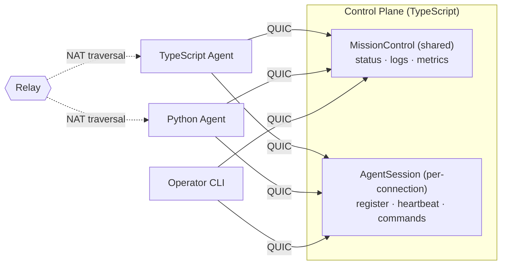

# Mission Control

> You need two services to talk. So you set up a load balancer, provision
> TLS certs, write protobuf schemas, compile them, configure a service mesh,
> deploy to Kubernetes, and pray the health checks converge before the
> demo tomorrow.
>
> Or: you write one TypeScript file and run it.

```typescript
@Service({ name: "MissionControl", version: 1 })
class MissionControl {
    @Rpc({ request: StatusRequest, response: StatusResponse })
    async getStatus(req: StatusRequest): Promise<StatusResponse> {
        return new StatusResponse({ agentId: req.agentId, status: "running" });
    }
}
```

```bash
bun run control.ts             # that's the server
aster shell aster1Qm...       # that's the client — tab completion, typed responses
```

No YAML. No protobuf compilation. No port numbers. No cloud account.
Encrypted, authenticated, works across NATs, and your Python
colleague can call it too.

**What you're replacing:** Traditional RPC means writing `.proto` files,
compiling them, setting up TLS certificates, configuring a reverse proxy
or service mesh so clients can find your service, managing certificate
rotation, and repeating all of that for every new service. With Aster you
get mTLS-grade mutual authentication (no CA infrastructure), gRPC-style
streaming RPCs (no `.proto` compilation), and peer-to-peer connectivity
(no port forwarding or load balancers). Your Python teammate calls your
TypeScript service without installing anything from your repo.

This guide builds **Mission Control** — a control plane for managing
remote agents. An agent could be a CI runner, an IoT sensor, an AI
worker, or a service on your colleague's laptop across the world.

In under an hour you'll have:
- Agents that check in, push metrics, and stream logs
- Operators that watch, issue commands, and control access
- A Python agent talking to the TypeScript control plane

Everything runs peer-to-peer. No infrastructure beyond a relay for
NAT traversal (self-hostable). Once peers find each other, traffic
flows direct.



> Aster uses [Iroh's public relays](https://iroh.computer) for discovery
> and NAT traversal by default. Point to your own with a single
> environment variable: `IROH_RELAY_URL=https://relay.yourcompany.com`.

---

## Chapter 1: Your First Agent Check-In (5 min)

**Goal:** The full working version of what you just saw — define a service,
start it, call it.

```typescript
// control.ts
import { AsterServer, Service, Rpc, WireType } from '@aster-rpc/aster';

@WireType("mission/StatusRequest")
class StatusRequest {
    agentId: string = "";
    constructor(init?: Partial<StatusRequest>) { if (init) Object.assign(this, init); }
}

@WireType("mission/StatusResponse")
class StatusResponse {
    agentId: string = "";
    status: string = "idle";
    uptimeSecs: number = 0;
    constructor(init?: Partial<StatusResponse>) { if (init) Object.assign(this, init); }
}

@Service({ name: "MissionControl", version: 1 })
class MissionControl {
    @Rpc({ request: StatusRequest, response: StatusResponse })
    async getStatus(req: StatusRequest): Promise<StatusResponse> {
        return new StatusResponse({
            agentId: req.agentId,
            status: "running",
            uptimeSecs: 3600,
        });
    }
}

async function main() {
    const server = new AsterServer({ services: [new MissionControl()] });
    await server.start();
    console.log(server.address);       // compact aster1... address
    await server.serve();
}

main();
```

```bash
# Terminal 1: start the control plane
bun run control.ts
# → aster1Qm...

# Terminal 2: connect and inspect
aster shell aster1Qm...
> cd services/MissionControl
> ./getStatus agentId="edge-node-7"
```

Or skip the shell entirely -- call it straight from the command line:

```bash
aster call aster1Qm... MissionControl.getStatus '{"agentId": "edge-node-7"}'
```

> **`aster shell` vs `aster call`:** Use `aster shell` for interactive
> exploration -- browsing services, tab-completing methods, streaming.
> Use `aster call` for scripting and one-shot invocations. Both use
> JSON serialization under the hood. For production code, use generated
> typed clients (Chapter 6).

**What just happened:**
- `@Service` + `@Rpc` defined a typed RPC contract
- `@WireType` made the types serializable across languages — no `.proto`
  files, no separate schema to maintain
- `AsterServer` created an encrypted QUIC endpoint and started listening —
  clients discover the service contract on connect
- `aster shell` connected, discovered the service, and invoked it — with
  tab completion and typed responses
- `aster call` invoked it non-interactively — Aster isn't just a library,
  it's a platform with a first-class CLI

> **Why the `{ request: ..., response: ... }` on `@Rpc`?** TypeScript erases
> generic and parameter types at runtime — by the time your service starts,
> there's no way for Aster to inspect `getStatus(req: StatusRequest)` and
> discover that `StatusRequest` is the wire type. Passing the constructors
> explicitly is what lets the contract publisher know which `@WireType`
> classes to publish, and what lets `aster contract gen-client` produce
> typed clients in any language. **Forget this and the published manifest
> has empty fields, breaking codegen for cross-language consumers.**

---

## Chapter 2: Live Log Streaming (5 min)

**Goal:** Agents push logs into the control plane. Operators tail them
in real time using server streaming.

```typescript
import { ServerStream } from '@aster-rpc/aster';

// Ordered severity used by the level filter below.
const LEVEL_ORDER: Record<string, number> = {
    debug: 0, info: 1, warn: 2, error: 3, fatal: 4,
};
function levelRank(level: string): number {
    return LEVEL_ORDER[level.toLowerCase()] ?? 0;
}

@WireType("mission/LogEntry")
class LogEntry {
    timestamp: number = 0.0;
    level: string = "info";
    message: string = "";
    agentId: string = "";
    constructor(init?: Partial<LogEntry>) { if (init) Object.assign(this, init); }
}

@WireType("mission/SubmitLogResult")
class SubmitLogResult {
    accepted: boolean = true;
    constructor(init?: Partial<SubmitLogResult>) { if (init) Object.assign(this, init); }
}

@WireType("mission/TailRequest")
class TailRequest {
    agentId: string = "";
    level: string = "info";    // minimum level filter
    constructor(init?: Partial<TailRequest>) { if (init) Object.assign(this, init); }
}

@Service({ name: "MissionControl", version: 1 })
class MissionControl {
    private _logBuffer: LogEntry[] = [];
    private _logResolve: ((entry: LogEntry) => void) | null = null;

    // ... getStatus from Chapter 1 ...

    @Rpc({ request: LogEntry, response: SubmitLogResult })
    async submitLog(entry: LogEntry): Promise<SubmitLogResult> {
        /** Agents call this to push log entries. */
        if (this._logResolve) {
            this._logResolve(entry);
            this._logResolve = null;
        } else {
            this._logBuffer.push(entry);
        }
        return new SubmitLogResult();
    }

    @ServerStream({ request: TailRequest, response: LogEntry })
    async *tailLogs(req: TailRequest): AsyncGenerator<LogEntry> {
        /** Stream log entries as they arrive. */
        while (true) {
            const entry = this._logBuffer.length > 0
                ? this._logBuffer.shift()!
                : await new Promise<LogEntry>(resolve => { this._logResolve = resolve; });
            if (req.agentId && entry.agentId !== req.agentId) continue;
            if (levelRank(entry.level) < levelRank(req.level)) continue;
            yield entry;
        }
    }
}
```

```bash
# In the shell:
> ./tailLogs agentId="edge-node-7" level="warn"
#0 {"timestamp": 1712567890.1, "level": "warn", "message": "disk 92% full", ...}
#1 {"timestamp": 1712567891.3, "level": "error", "message": "health check failed", ...}
# Ctrl+C to stop
```

Or from your own TypeScript code using the proxy client:

```typescript
// tail-logs.ts — consume a server stream programmatically
import { AsterClientWrapper } from '@aster-rpc/aster';

const client = new AsterClientWrapper({ address: "aster1Qm..." });
await client.connect();
const mc = client.proxy("MissionControl");

// Server-streaming methods are called via `.stream(...)` and iterated
// with `for await`. Calling `await mc.tailLogs({...})` directly is for
// unary methods only — it will throw on a streaming RPC.
for await (const entry of mc.tailLogs.stream({ level: "warn" })) {
    console.log(entry);
}

await client.close();
```

> **Tip:** `tailLogs` blocks until a log entry arrives. If the buffer is
> empty, the client waits. Submit a log entry from another terminal
> (or via `aster call ... MissionControl.submitLog '{"message":"test"}'`)
> to see it appear in the stream. Press Ctrl+C to stop.

> **Proxy method shapes** — the proxy uses a different call form per RPC
> pattern, mirroring what each one actually does:
>
> | Pattern | How to call it |
> |---|---|
> | Unary | `await mc.getStatus({...})` |
> | Server stream | `for await (const x of mc.tailLogs.stream({...})) { ... }` |
> | Client stream | `await mc.ingestMetrics(asyncIter)` |
> | Bidi stream | `const ch = mc.runCommand.bidi(); await ch.open(); ...` |

**What just happened:**
- `@ServerStream` turns an async generator into a streaming RPC
- The client receives items as they're yielded -- no polling, no websockets
- Under the hood: a single QUIC stream, with Aster framing, flowing until
  either side closes it
- Agents push entries via `submitLog` -- a simple buffer + promise under
  the hood. Aster services are plain TypeScript classes with plain state

---

## Chapter 3: Metric Ingestion (5 min)

**Goal:** Agents push thousands of metric datapoints per second using
client streaming.

```typescript
import { ClientStream } from '@aster-rpc/aster';

@WireType("mission/MetricPoint")
class MetricPoint {
    name: string = "";
    value: number = 0.0;
    timestamp: number = 0.0;
    tags: Record<string, string> = {};
    constructor(init?: Partial<MetricPoint>) { if (init) Object.assign(this, init); }
}

@WireType("mission/IngestResult")
class IngestResult {
    accepted: number = 0;
    dropped: number = 0;
    constructor(init?: Partial<IngestResult>) { if (init) Object.assign(this, init); }
}

@Service({ name: "MissionControl", version: 1 })
class MissionControl {
    // ... previous methods ...

    @ClientStream({ request: MetricPoint, response: IngestResult })
    async ingestMetrics(stream: AsyncIterable<MetricPoint>): Promise<IngestResult> {
        /** Receive a stream of metric points from an agent. */
        let accepted = 0;
        for await (const point of stream) {
            this.storeMetric(point);
            accepted += 1;
        }
        return new IngestResult({ accepted });
    }
}
```

On the agent side, we'll start with a **proxy client** — quick to set up,
no types needed on the consumer side:

```typescript
// agent.ts — proxy client (good for prototyping)
import { AsterClientWrapper, IrohTransport } from '@aster-rpc/aster';

async function main() {
    const client = new AsterClientWrapper({ address: "aster1Qm..." });
    await client.connect();
    const mc = client.proxy("MissionControl");

    // Stream 10,000 metrics — the proxy accepts plain objects
    async function* metrics() {
        for (let i = 0; i < 10_000; i++) {
            yield { name: "cpu.usage", value: Math.random(), timestamp: Date.now() / 1000 };
        }
    }

    const result = await mc.ingestMetrics(metrics());
    console.log(`Accepted: ${result.accepted}`);

    await client.close();
}

main();
```

The proxy client discovers methods from the contract and sends plain objects
over the wire. Great for scripting, prototyping, and generic gateways — if
you're building a dashboard that talks to any Aster service without
knowing its types at compile time, the proxy is your best friend.

> **Proxy vs Typed client** — For production, generate a typed client
> with `aster contract gen-client` and use `fromConnection()`:
>
> ```typescript
> import { MissionControlClient } from './mission_control/services/mission_control_v1';
> const mc = await MissionControlClient.fromConnection(client);
> const result = await mc.ingestMetrics(metricStream());   // IDE autocomplete, type checking
> console.log(result.accepted);                             // typed, not result['accepted']
> ```
>
> Same wire protocol, same contract — just with type safety. Use the proxy
> for scripts and exploration, the generated client for production services.

**What just happened:**
- Client streaming sends many messages, gets one response at the end
- The producer processes items as they arrive — no buffering the entire batch
- The proxy client requires no type imports — it reads the contract from
  the producer and builds method stubs dynamically
- This is how you'd build telemetry ingestion, log shipping, or bulk data upload

---

## Chapter 4: Agent Sessions & Remote Commands (5 min)

**Goal:** Each agent gets its own session — register, heartbeat, and
execute commands. This is where per-agent state and bidi streaming meet.

`MissionControl` is a shared service — one instance, all clients see the
same state. But each agent needs its own identity, capabilities, and
command channel. That's a session-scoped service:

```typescript
import { BidiStream } from '@aster-rpc/aster';
import { exec } from 'child_process';
import { promisify } from 'util';
const execAsync = promisify(exec);

@WireType("mission/Heartbeat")
class Heartbeat {
    agentId: string = "";
    capabilities: string[] = [];   // ["gpu", "arm64", ...]
    loadAvg: number = 0.0;
    constructor(init?: Partial<Heartbeat>) { if (init) Object.assign(this, init); }
}

@WireType("mission/Assignment")
class Assignment {
    taskId: string = "";
    command: string = "";
    constructor(init?: Partial<Assignment>) { if (init) Object.assign(this, init); }
}

@WireType("mission/Command")
class Command {
    command: string = "";
    constructor(init?: Partial<Command>) { if (init) Object.assign(this, init); }
}

@WireType("mission/CommandResult")
class CommandResult {
    stdout: string = "";
    stderr: string = "";
    exitCode: number = -1;    // -1 means still running
    constructor(init?: Partial<CommandResult>) { if (init) Object.assign(this, init); }
}

@Service({ name: "AgentSession", version: 1, scoped: "session" })
class AgentSession {
    /** Session-scoped: one instance per connected agent. */
    private _peer: string | null;
    private _agentId: string = "";
    private _capabilities: string[] = [];


    constructor(peer?: string) {
        this._peer = peer ?? null;
    }

    @Rpc({ request: Heartbeat, response: Assignment })
    async register(hb: Heartbeat): Promise<Assignment> {
        /** Agent announces itself and gets an assignment. */
        this._agentId = hb.agentId;
        this._capabilities = hb.capabilities;
        if (hb.capabilities.includes("gpu")) {
            return new Assignment({ taskId: "train-42", command: "python train.py" });
        }
        return new Assignment({ taskId: "idle", command: "sleep 60" });
    }

    @Rpc({ request: Heartbeat, response: Assignment })
    async heartbeat(hb: Heartbeat): Promise<Assignment> {
        /** Periodic check-in — update load, maybe get new work. */
        this._capabilities = hb.capabilities;
        return new Assignment({ taskId: "continue", command: "" });
    }

    @BidiStream({ request: Command, response: CommandResult })
    async *runCommand(commands: AsyncIterable<Command>): AsyncGenerator<CommandResult> {
        /** Execute commands on this agent — stream in, results stream back. */
        for await (const cmd of commands) {
            try {
                const { stdout, stderr } = await execAsync(cmd.command);
                yield new CommandResult({
                    stdout,
                    stderr,
                    exitCode: 0,
                });
            } catch (err: any) {
                yield new CommandResult({
                    stdout: err.stdout ?? "",
                    stderr: err.stderr ?? err.message,
                    exitCode: err.code ?? 1,
                });
            }
        }
    }
}
```

```bash
# Operator connects and opens a session subshell:
aster shell aster1Qm...
> cd services
> session AgentSession
# prompt becomes "AgentSession~" — you're now in a dedicated session.
# State persists across calls; the same instance handles every method.
AgentSession~ register agentId="edge-7" capabilities='["gpu"]'
← {"agentId": "edge-7", "task": "train-42"}
AgentSession~ runCommand command="df -h"
← {"stdout": "Filesystem  Size  Used ...", "exitCode": 0}
AgentSession~ runCommand command="uptime"
← {"stdout": " 14:32  up 3 days ...", "exitCode": 0}
AgentSession~ end
```

> **Why a session subshell?** Session-scoped services hold per-connection
> state. If you tried `./runCommand` directly from `/services/AgentSession`,
> the shell would open a new stream per call and tear down the state
> between them. The `session` command opens one persistent session and
> routes every method through it. The `AgentSession~` prompt makes it
> obvious you're inside a stateful session. Type `end` to close it.

**What just happened:**
- `scoped: "session"` creates a fresh `AgentSession` per connection — each
  agent gets its own identity, capabilities, and command channel
- `runCommand` uses bidi streaming: commands flow in, results flow back,
  all on a single multiplexed QUIC stream
- State like `this._agentId` is private to that agent's session — no
  hand-rolled connection maps
- When the agent disconnects, the session is cleaned up automatically

Two service types, two different lifetimes:
- **`MissionControl`** (shared) — fleet-wide: status, logs, metrics
- **`AgentSession`** (session) — per-agent: register, heartbeat, commands

---

## Chapter 5: Auth & Capabilities (5 min)

**Goal:** Not every caller should be able to deploy or run commands on agents.
Define roles, compose requirements, and issue scoped credentials.

Up until now the system has run in `open-gate` mode. That's fine sometimes, but other times you need to put controls on who can access your service. In this step, we will enable authentication so our service will no longer be open to anyone who contacts our node — callers will have to prove they're _authorized_.

The auth flow has three steps:
1. **Define** -- declare which capabilities each method requires (in code)
2. **Issue** -- create credentials with specific capabilities (CLI)
3. **Connect** -- present the credential on connect; the framework enforces access

The credential carries an `aster.role` attribute with a comma-separated
list of capabilities. The server's `CapabilityInterceptor` checks this
list against each method's `requires` declaration. No middleware to
write, no token parsing -- it's declarative.

### Step 1: Generate a root key

The root key is the trust anchor for your entire deployment. **It identifies you personally as the owner of your deployment**. Keep it
offline — you'll use it to sign credentials, not to run services.

```bash
# One-time setup — generates an Ed25519 keypair
aster trust keygen --out-key ~/.aster/root.key

# Output:
# Root private key written to: ~/.aster/root.key
# Root public key written to:  ~/.aster/root.pub
# Public key: b3a4f1...
# Keep root.key secret. Share root.pub with nodes that need to verify credentials.
```

### Step 2: Define roles in code

```typescript
import { anyOf } from '@aster-rpc/aster';
// Also available: `allOf(A, B)` — caller must have BOTH roles.

/** Capabilities that can be granted to consumers. */
const Role = {
    STATUS:  "ops.status",      // read service status
    LOGS:    "ops.logs",        // tail live logs
    ADMIN:   "ops.admin",       // run commands on agents
    INGEST:  "ops.ingest",      // push metrics (agents)
} as const;
```

Apply requirements to methods. Simple cases take a single role;
complex cases compose with `anyOf` / `allOf`:

```typescript
@Service({ name: "MissionControl", version: 1 })
class MissionControl {

    @Rpc({ request: StatusRequest, response: StatusResponse, requires: Role.STATUS })
    async getStatus(req: StatusRequest): Promise<StatusResponse> { ... }

    @ServerStream({
        request: TailRequest,
        response: LogEntry,
        requires: anyOf(Role.LOGS, Role.ADMIN),
    })
    async *tailLogs(req: TailRequest): AsyncGenerator<LogEntry> {
        /** Log access for log viewers OR admins — either role works. */
        ...
    }

    @ClientStream({
        request: MetricPoint,
        response: IngestResult,
        requires: Role.INGEST,
    })
    async ingestMetrics(stream: AsyncIterable<MetricPoint>): Promise<IngestResult> {
        /** Agents push metrics — scoped to the ingest role. */
        ...
    }
}

@Service({ name: "AgentSession", version: 1, scoped: "session" })
class AgentSession {

    @Rpc({ request: Heartbeat, response: Assignment, requires: Role.INGEST })
    async register(hb: Heartbeat): Promise<Assignment> { ... }

    @BidiStream({
        request: Command,
        response: CommandResult,
        requires: Role.ADMIN,
    })
    async *runCommand(commands: AsyncIterable<Command>): AsyncGenerator<CommandResult> {
        /** Command execution is admin-only. */
        ...
    }
}
```

> **Reminder:** every `@Rpc` / `@ServerStream` / `@ClientStream` /
> `@BidiStream` needs the explicit `request:` and `response:` constructors
> alongside `requires:`. Missing them will fire a warning at server start
> and the published manifest will have empty fields, breaking gen-client
> for cross-language consumers.

### Step 3: Start the control plane with auth

```typescript
const server = new AsterServer({
    services: [new MissionControl(), new AgentSession()],
    identity: ".aster-identity", // <- this is the identity of the endpoint
    peer: "mission-control",
    config: {
        rootPubkeyFile: "~/.aster/root.pub", // <- this is the owner's public key (i.e. yours)
    },
    allowAllConsumers: false,   // require credentials
});
await server.start();
console.log(server.address);
await server.serve();
```

Each Aster endpoint will have its own identity (secret key pair) and it will have the public key of its owner (you) so it knows who administers it.

> **No `.aster-identity` file?** Aster generates a fresh ephemeral keypair on startup. That's fine for experiments, but every restart gives you a new endpoint id — and any credentials you issued to the old one will stop working. Once you start enrolling peers, commit to a persistent identity file.

### Step 4: Enroll agents

When you want to allow another endpoint connect to yours, you must give it permission. You do that by generating a _credential_ for it and putting in it the roles that endpoint should have.

```bash
# Issue a credential for an edge agent -- status and ingest only
aster enroll node --role consumer --name "edge-node-7" \
    --capabilities ops.status,ops.ingest \
    --root-key ~/.aster/root.key \
    --out edge-node-7.cred
```

`aster enroll node` will print a summary like this:

```
✓ Enrollment credential created

  File:         /home/you/work/edge-node-7.cred
  Format:       TOML (.aster-identity) with [node] + [[peers]] sections

  Peer:         edge-node-7
  Role:         consumer (policy)
  Capabilities: ops.status,ops.ingest
  Endpoint ID:  142179f10b7bc606...
  Trust root:   cd948e4c1456cdbe...
  Expires:      2026-05-10T20:20:12+00:00

  This file lets a consumer connect to your trusted-mode servers.
  It contains a node identity (secret key) AND a signed enrollment
  credential. The server validates the credential and grants the
  capabilities listed below.

  Use it:
  aster shell <peer-addr> --rcan edge-node-7.cred
  aster call <peer-addr> Service.method '<json>' --rcan edge-node-7.cred

  ⚠  Keep this file secret -- it is both an identity AND a credential.
```

> **What's in the file?** Despite the `.cred` extension, it's a regular
> `.aster-identity` TOML file with two sections:
>
> - `[node]` — the consumer's secret key + endpoint ID. Used by the
>   QUIC layer to prove the consumer's identity.
> - `[[peers]]` — the signed enrollment credential. Presented to
>   servers to claim capabilities.
>
> Both sections live in the same file because they're paired: the
> server checks that the QUIC peer ID matches the credential's
> `endpoint_id`. If they don't match, admission fails.

```bash
# Issue a credential for the ops team -- full access including admin
aster enroll node --role consumer --name "ops-team" \
    --capabilities ops.status,ops.logs,ops.admin,ops.ingest \
    --root-key ~/.aster/root.key \
    --out ops-team.cred
```

> **Need quiet output for scripts?** Use `--quiet` (or `-q`). The
> command prints exactly one line: `<path> <endpoint_id> <expires_iso>`
> on success and exits non-zero on failure. Easy to parse from CI.

### Step 5: Connect with credentials

```typescript
// agent.ts — connecting with a scoped credential
import { AsterClientWrapper } from '@aster-rpc/aster';

async function main() {
    const client = new AsterClientWrapper({
        address: "aster1Qm...",
        enrollmentCredentialFile: "edge-node-7.cred",
    });
    await client.connect();
    const mc = client.proxy("MissionControl");
    const agent = client.proxy("AgentSession");

    await mc.getStatus({ agentId: "test" });     // OK — has ops.status
    await mc.ingestMetrics(...);                   // OK — has ops.ingest
    // await agent.runCommand(...);                // AccessDenied — missing ops.admin

    await client.close();
}

main();
```

```bash
# Or from the CLI — the shell respects credentials too
aster shell aster1Qm... --rcan ops-team.cred
> cd services
> session AgentSession                 # opens session subshell
AgentSession~ runCommand command="df"  # ✓ ops-team has ops.admin
```

**What just happened:**
- `aster trust keygen` created the root of trust — one command
- `aster enroll node --role consumer` issued scoped credentials — no CA infrastructure
- `requires: Role.ADMIN` — Aster checks at the method level, no auth middleware to write
- `anyOf(A, B)` — caller must have at LEAST ONE (log viewers OR admins can tail)
- The edge agent can push metrics but can't run commands. The ops team can do both.
  That's the entire access control model — defined in code, enforced at the wire level

---

## Chapter 6: Generating Typed Clients (5 min)

**Goal:** Your teammate wants to write a TypeScript script that calls Mission
Control — without importing your source code. Generate a typed client
directly from the running service.

So far you've been using the shell to explore. But for production code,
you want typed clients with IDE autocomplete and compile-time checking.

> **Following on from Chapter 5?** `gen-client` against a live node opens a
> regular consumer connection, so if your server is running in trusted mode
> (`allowAllConsumers: false`) the same credential rules apply: append
> `--rcan ops-team.cred` (or any credential with read access) to the
> commands below. If your server is still in open-gate mode, no credential
> is needed.

### Option A: Generate from a running service

```bash
# Generate a TypeScript client from the live control plane.
# Add `--rcan ops-team.cred` if the server is in trusted mode (Chapter 5).
aster contract gen-client aster1Qm... --out ./clients --package mission_control --lang typescript

# Output:
# Generated 5 files
#   ./clients/mission_control/types/mission-control-v1.ts
#   ./clients/mission_control/types/agent-session-v1.ts
#   ./clients/mission_control/services/mission-control-v1.ts
#   ./clients/mission_control/services/agent-session-v1.ts
#   ./clients/mission_control/index.ts
```

### Option B: Generate from an exported manifest

If the producer shared a `.aster.json` file (from `aster contract export`):

```bash
aster contract gen-client ./MissionControl.aster.json --out ./clients --package mission_control --lang typescript
```

`--lang python` works the same way; pick the language that matches the
consumer you're writing.

### Using the generated client

```typescript
// consumer.ts — typed client with IDE autocomplete
import { AsterClientWrapper } from '@aster-rpc/aster';
import { MissionControlClient } from './clients/mission_control/services/mission-control-v1.js';
import { StatusRequest } from './clients/mission_control/types/mission-control-v1.js';
import { AgentSessionClient } from './clients/mission_control/services/agent-session-v1.js';
import { Heartbeat } from './clients/mission_control/types/agent-session-v1.js';

async function main() {
    const client = new AsterClientWrapper({ address: "aster1Qm..." });
    await client.connect();

    // Shared service: every call gets a fresh stream over the same QUIC connection
    const mc = await MissionControlClient.fromConnection(client);
    const status = await mc.getStatus(new StatusRequest({ agentId: "edge-node-7" }));
    console.log(`Status: ${status.status}, uptime: ${status.uptimeSecs}s`);

    // Session-scoped service: one persistent bidi stream per fromConnection,
    // server-side state survives across calls
    const agent = await AgentSessionClient.fromConnection(client);
    const assignment = await agent.register(new Heartbeat({
        agentId: "edge-node-7",
        capabilities: ["gpu"],
    }));
    console.log(`Assigned: ${assignment.taskId} -> ${assignment.command}`);

    await client.close();
}

main();
```

> **Two client kinds, one API.** The generator emits a different shim for
> shared vs session-scoped services, but `fromConnection(client)` looks
> identical from the call site. Shared services delegate to the wrapper's
> shared RPC transport; session services route through `client.proxy()` to
> reuse the existing session-protocol machinery, so per-agent state survives
> across calls just like in the shell's `session AgentSession` subshell.

If you'd rather skip codegen entirely, the **proxy client** is still
available — same wire format, no typed signatures:

```typescript
const mc = client.proxy("MissionControl");
const resp = await mc.getStatus({ agentId: "edge-node-7" }) as any;
console.log(`Status: ${resp.status}, uptime: ${resp.uptimeSecs}s`);
```

Use the proxy for prototyping and one-off scripts; use the generated typed
client for production code where IDE autocomplete and compile-time checking
matter.

**What just happened:**
- `aster contract gen-client` pulled the contract from the running service
  and generated typed clients in either TypeScript or Python — no `.proto`
  files, no shared repo
- The generated client's `fromConnection()` resolves the service on the
  wrapper's admission summary and reuses the existing RPC transport
- Every generated class carries a `contractId` so the consumer can detect
  when the producer has been updated
- The same command works from a `.aster.json` export file — the producer
  doesn't even need to be running

---

## Chapter 7: Cross-Language — Python Agent (5 min)

**Goal:** Your teammate wants to send metrics from their Python
application. They don't have your TypeScript source — just the ticket.

> **Who owns the contract?** The producer — in this case, your
> TypeScript service. Field names on the wire are whatever the
> **producer** defines them as. This Mission Control was written in
> TypeScript with camelCase fields, so the wire is `agentId`,
> `uptimeSecs`, `taskId` regardless of what language the consumer is
> written in.
>
> Aster's contract validation is **strict**: extra or misspelled
> JSON fields are rejected at decode time with a `CONTRACT_VIOLATION`
> status code, naming the offending field. There's no auto-rename or
> camel/snake normalization to hide bugs. If your Python teammate
> typos `agent_id` (Python's natural idiom) the server tells them so
> immediately, on the same call.
>
> If they generate a typed client (`aster contract gen-client …
> --lang python`), the codegen reads the producer's manifest and
> emits Python dataclasses with the producer's field names. They use
> them like any other dataclass — no thinking about wire format. If
> they hand-roll JSON keys via the proxy client below, they have to
> use the producer's field names directly.

Generate a Python client the same way you generated the TypeScript one:

```bash
# Generate Python types + client from the running service
aster contract gen-client aster1Qm... --out ./generated --package mission_control --lang python
```

You can now `from generated.mission_control.services.mission_control_v1
import MissionControlClient` and use the typed Python client just like the
TS one. If you'd rather skip codegen, the proxy client works too — but
your Python teammate will need to use the TS server's camelCase field
names directly:

```python
from aster import AsterClient

async def main():
    client = AsterClient(address="aster1Qm...")
    await client.connect()

    # Proxy client — discovers methods from the contract.
    # NOTE: camelCase field names because the PRODUCER (this TS
    # MissionControl) defines them that way. The wire format is the
    # producer's contract; consumers use it as-is.
    mc = client.proxy("MissionControl")
    status = await mc.getStatus({"agentId": "py-worker-1"})
    print(f"Status: {status['agentId']} is {status['status']}")

    # Stream metrics from Python to the TypeScript control plane
    async def metrics():
        import random, time
        for i in range(1000):
            yield {"name": "gpu.temp", "value": 72 + random.random() * 10}

    result = await mc.ingestMetrics(metrics())
    print(f"Accepted: {result['accepted']}")

if __name__ == "__main__":
    import asyncio
    asyncio.run(main())
```

**What just happened:**
- Your teammate never saw your TypeScript source code
- The proxy client discovered the contract on connect and built method
  stubs dynamically — full RPC, no codegen required
- Same wire format, same contract hash — the TypeScript producer and
  Python consumer agree on the protocol without sharing a repo
- When Python codegen lands, `--lang python` will produce the
  same typed client experience as TypeScript

> **"But there's no .proto file — how does Python know what TypeScript
> sent?"** — The `@WireType` decorator registers each type's schema in
> Aster's content-addressed contract. The contract is published with the
> service and discovered on connect. `aster contract gen-client` pulls
> that metadata and generates native types in any supported language.
> The contract is the shared schema — you just never had to write it
> by hand.

---

## Appendix: Running the Benchmarks

```bash
cd examples/mission-control
bun run bench/benchmark.ts

# Example output (local loopback, Apple M2, illustrative):
# ┌─────────────────────────────────┐
# │ Mission Control Benchmark       │
# ├──────────────┬──────────────────┤
# │ Unary        │ 12,400 req/s     │
# │ Server stream│ 48,000 msg/s     │
# │ Client stream│ 52,000 msg/s     │
# │ Bidi stream  │ 31,000 msg/s     │
# │ Latency p50  │ 0.08 ms          │
# │ Latency p99  │ 0.34 ms          │
# └──────────────┴──────────────────┘
```

---

## What's Next?

You just built a working control plane with four RPC patterns, session-scoped
agents, capability-based auth, published discovery, and cross-language
interop. That's a real system — not a demo.

There's more to Aster that you didn't need today but will want in
production: built-in observability, load balancing, fail-over, and
high availability — all on a distributed foundation using
content-addressed data, CRDTs, and gossip protocols.

Next guides in the series:
- **Hardening for Production** — interceptors for retry, circuit-breaking,
  rate limiting, and deadlines
- **Scaling Out** — multiple producers with automatic fail-over
- **Artifact Distribution** — push builds and model weights to agents
  with content-addressed blobs
- **Shared Fleet State** — CRDT documents that sync across your fleet

The full source for this example is in `examples/mission-control/`.
